# Dense-Armor — Architecture Map

Generated by scanning the real package tree (`find dense_armor -name "*.py"`), not from
memory — kept here so an agent (Claude Code, another CLI agent, or an MCP client) can
orient itself without re-scanning the whole codebase every session. Update this file
whenever a module is added, moved, or renamed.

## How to read this

`dense_armor/` has **one public entry point** and **three internal layers**:

1. **`armatura.py`** — the public API surface. `Armatura` is the only class re-exported by
   `dense_armor/__init__.py`'s `__all__`; everything else is reached through it or imported
   directly by advanced callers.
2. **`core/`** — the actual damping/shielding engine: the Phi_AB/trigger hybrid shield,
   adaptive signal stabilization, noise injection for testing, memory guarding, and the
   JAX-JIT pipeline compiler `Armatura` drives.
3. **`utility/`** — statistical primitives and standalone signal-processing tools. Most of
   these are called *by* `core/`, but several (`robust_filters.py`, `arbiter.py`) are also
   real, independently useful modules in their own right.
4. **`mcp_server/`** — the MCP tool adapter (`dense-armor-mcp` console script), exposing a
   subset of `Armatura`'s functionality as MCP tools for an agent to call directly.

```mermaid
graph TD
    ROOT["dense_armor/__init__.py<br/>(public API: Armatura)"]

    subgraph API["1. Public API"]
        ARMATURA["armatura.py<br/>class Armatura<br/>analizza, deriva, referto, referto_json"]
    end

    subgraph CORE["2. Core Engine"]
        HYBRID["hybrid_engine.py<br/>hybrid_shield, calculate_phi_ab,<br/>calculate_vettore_dinamico, evaluate_phi_trigger"]
        ENGINE["engine.py<br/>AdaptiveSignalStabilizer,<br/>dynamic_damping_gain"]
        DAMP["damping_operator.py<br/>apply_damping_blend"]
        NOISE["noise.py<br/>AIHardwareProfiler,<br/>StochasticAdversarialNoise"]
        MEMORY["memory.py<br/>UniversalMemoryGuard,<br/>MemoryPressureError"]
        COMPILER["compiler.py<br/>DynamicAICodegen<br/>(JAX JIT pipeline)"]
        CHUNK["chunk.py — ImageChunker"]
        TENSOR["tensor.py — TensorVault"]
        VECTOR["vector.py<br/>BitwisePermutationEngine,<br/>ParametricScenarioSimulator"]
        PROFILER["profiler.py — PipelineProfiler"]
        VISUALIZER["visualizer.py — AIEngineVisualizer"]
        LOGGER["logger.py<br/>get_json_file_logger"]
        PRESET["preset.py"]
    end

    subgraph UTIL["3. Utility — Statistics &amp; Signal Processing"]
        ROBUST["robust_filters.py<br/>chauvenet_criterion, tukey_fences,<br/>hampel_filter (Lagrange-multiplier BLUE combination)"]
        ARBITER["arbiter.py<br/>classify_segments, route_and_correct"]
        STREAM["streaming.py<br/>StreamingDeviationDetector,<br/>MultiChannelStreamingDeviationDetector"]
        CUSUM["cusum.py<br/>cusum_detector,<br/>one_sided_arl, two_sided_arl, detectability_report"]
        SFF["stable_frame_filter.py<br/>velocity_gated_stable_mask"]
        ONESIDED["one_sided.py — one_sided_upper_filter"]
        RATELIM["rate_limiter.py — rate_limited_follower"]
        UHEAL["healing.py — healing_filter"]
        METRO["metro.py — class Metro (scaler)"]
        DIAG["diagnostic.py — diag"]
        CURV["curvature.py — curvature"]
        COLLATZ["collatz.py — class ABCollatz"]
        RESON["resonance_search.py<br/>apply_fast_resonance"]
        ORCA["orca.py — class Orca"]
        IODAT["iodat.py — lodat"]
        ANWAV["anwav.py — anwav"]
    end

    subgraph MCP["4. MCP Server"]
        SERVER["server.py — main()<br/>(dense-armor-mcp entry point)"]
        TOOLS["tools.py<br/>dense_armor_clean_signal, _detect_anomalies,<br/>_heal_series, _robust_filter, _health,<br/>_stream_start/_update/_end (stateful)"]
        MODELS["models.py<br/>CleanSignalInput, DetectAnomaliesInput,<br/>RobustFilterInput, HealSeriesInput"]
    end

    ROOT --> ARMATURA
    ARMATURA --> HYBRID
    ARMATURA --> METRO
    HYBRID --> DAMP
    ENGINE --> DAMP
    CORE --> UTIL
    SERVER --> TOOLS
    TOOLS --> MODELS
    TOOLS -.->|"calls"| ARMATURA
    TOOLS -.->|"calls"| ROBUST
    STREAM -.->|"reuses causal window logic from"| ARBITER
    CUSUM -.->|"shares robust median/MAD convention with"| ARBITER

    ROOT --> CORE
    ROOT --> UTIL
    ROOT --> MCP
```

## Notable cross-package facts (verified, not assumed)

- **`Armatura`** (`armatura.py`) is a thin orchestrator: it imports `hybrid_shield` directly
  from `core/hybrid_engine.py` and `Metro` directly from `utility/metro.py` rather than
  going through any intermediate re-export layer — those two are its only direct internal
  dependencies at import time.
- **`hybrid_engine.py`**'s `calculate_phi_ab`/`calculate_vettore_dinamico`/
  `evaluate_phi_trigger` naming mirrors Dense-Evolution's own `healing.py` primitives
  (`calculate_phi_ab`, `calculate_vettore_dinamico`, `delta_preemp`) — Dense-Armor is the
  sister project (same author, same predictive-healing math family) applied to general
  AI I/O signals instead of quantum circuit noise, not a copy-paste duplicate.
- **`utility/robust_filters.py`** implements the combined Chauvenet/Tukey/Hampel/
  sigma-clipping anomaly detector (Lagrange-multiplier BLUE combination) validated against
  real H2 dissociation-curve chemistry data with 0 false positives and an injected glitch
  caught at 8.46σ — see the maintainer's own project notes for that validation run.
- **`mcp_server/tools.py`** wraps a *subset* of `Armatura`'s and `utility/`'s functionality
  as 5 MCP tools (`clean_signal`, `detect_anomalies`, `heal_series`, `robust_filter`,
  `health`) — not a 1:1 mirror of the full public API, unlike Dense-Evolution's MCP server
  which exposes closer to the complete surface.
- **`utility/streaming.py`** and **`utility/cusum.py`** were both promoted from
  Dense-Evolution-Discovery after validation on two independent real physical domains each
  (robot arm + IMU for streaming; lidar + accelerometer for the CUSUM ARL theory) — not
  written fresh inside this repo. `streaming.py` reuses `arbiter.py`'s causal-window
  convention directly (`_robust_center_scale`); `cusum.py`'s own `_robust_center_scale` is a
  separate copy of the same logic, not a shared import, so the two modules can evolve
  independently.

## Maintenance

Regenerate the `graph TD` block above (not by hand — re-run `find dense_armor -name
"*.py"` and re-derive) whenever:
- A new module is added under `dense_armor/core/`, `utility/`, or `mcp_server/`.
- `Armatura`'s direct internal imports change.
- A new MCP tool is added to `mcp_server/tools.py`.

Do not let this file silently drift from the real tree — an agent trusting a stale map is
worse than one that re-scans.
