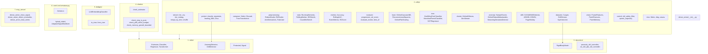

# Dense-Armor — Architecture

Map of `dense_armor`: it lets a person or an agent orient itself in the package without reading
every file. Update it whenever a module is added, moved or renamed.

## How to read it

1. `roles` — the base classes every estimator builds on: `Estimator`, `Classifier`,
   `Regressor`, `Transformer`, `AnomalyDetector`, `DriftDetector`, `Protected`, `Signal` and
   the other support classes.
2. `utility` — the online-learning library, one subpackage per section of the programme:
   `stream`, `datasets`, `compose`, `preprocessing`, `stats`, `metrics`, `evaluate`, `learn`,
   `tree`, `cluster`, `anomaly`, `drift`, `protect`, `vision`, `control`, `misc`.
3. `dynamics` — rigid-body dynamics from URDF.
4. `checks` — `check_estimator` and the robot checks.
5. `bridges` — optional bridges (LLM embeddings, and a bridge to existing online-learning
   libraries).
6. `core` and `armatura.py` — the signal-shielding engine and its public class `Armatura`.
7. `mcp_server` — the MCP tool adapter.


```mermaid
graph TD
    ROOT["dense_armor/__init__.py"]

    subgraph ROLES["1. roles/"]
        EST["Estimator, Classifier, Regressor, Transformer"]
        DET["AnomalyDetector, DriftDetector"]
        PROT["Protected, Signal"]
    end

    subgraph UTIL["2. utility/"]
        STREAM["stream: iter_csv, iter_rosbag,<br/>merge_by_time, shuffle"]
        DATASETS["datasets: Casper, DriftStream,<br/>SyntheticArm"]
        COMPOSE["compose: Select, Discard,<br/>FuncTransformer"]
        PREPROC["preprocessing: RobustScaler, EWScaler,<br/>JointDerivatives, Tokenizer"]
        STATS["stats: RunningMoments,<br/>RollingMedian, DDSketch,<br/>CountMinSketch"]
        METRICS["metrics: Accuracy, RollingAUC,<br/>EventMetrics, R2Score"]
        EVAL["evaluate: progressive_val_score,<br/>evaluate_events, best_of"]
        LEARN["learn: OnlineGaussianNB,<br/>RecursiveLeastSquares,<br/>OnlinePlattScaling"]
        TREE["tree: HoeffdingTreeClassifier,<br/>MondrianForestClassifier,<br/>SGTRegressor"]
        CLUSTER["cluster: OnlineKMeans, DenStream"]
        ANOMALY["anomaly: HampelScorer,<br/>OnlineRobustMahalanobis,<br/>StreamingDeviationDetector"]
        DRIFT["drift: CUSUMDriftDetector,<br/>ADWIN, KSWIN, PageHinkley"]
        PROTECT["protect: classify_segments,<br/>healing_filter, Orca"]
        VISION["vision: FrameFeatures,<br/>PatchFeatures, PatchMemory"]
        CONTROL["control: cbf_safety_filter,<br/>quintic_trajectory"]
        MISC["misc: Metro, diag, anwav"]
    end

    subgraph DYN["3. dynamics/"]
        RBM["RigidBodyModel"]
        CBFC["passivity_cbf_controller,<br/>six_dof_pbc_cbf_controller"]
    end

    subgraph CHECKS["4. checks/"]
        CE["check_estimator"]
        RC["check_step_is_pure,<br/>check_p99_within_budget,<br/>check_memory_growth_bounded"]
    end

    subgraph BRIDGES["5. bridges/"]
        LLM["LLMEmbeddingClassifier"]
        RIV["to_river, from_river"]
    end

    subgraph CORE["6. core/ and armatura.py"]
        ARM["Armatura"]
        HYB["hybrid_shield,<br/>AdaptiveSignalStabilizer"]
    end

    subgraph MCP["7. mcp_server/"]
        MTOOLS["dense_armor_clean_signal,<br/>dense_armor_detect_anomalies,<br/>dense_armor_heal_series"]
    end

    UTIL --> ROLES
    CHECKS --> ROLES
    PROTECT --> DET
    DATASETS --> RBM
```

## 1. roles

| file | public names | what it is |
|---|---|---|
| `_util.py` | `accepts_kwarg`, `call_with_t` | helpers shared by the role classes |
| `agents.py` | `schema`, `call_json` | schema and dispatch of JSON calls |
| `anomaly_detector.py` | `AnomalyDetector`, `AnomalyGate` | base anomaly detector and its gate |
| `classifier.py` | `Classifier` | base class for supervised classifiers |
| `drift_detector.py` | `DriftDetector` | base class for drift detectors |
| `estimator.py` | `Estimator` | root estimator with pipeline composition |
| `physics.py` | `UnitSpec`, `unit_spec_of`, `UnitCheckedPipeline`, `JointLimits`, `limits_from_urdf`, `PhysicalLimitsGuard` | unit specification and joint-limit helpers |
| `protection.py` | `Protected` | wrapper that skips learning on flagged samples |
| `realtime.py` | `ProfileResult`, `profile`, `RealtimePipeline`, `PureEW` | latency profile and real-time pipeline |
| `regressor.py` | `Regressor` | base class for supervised regressors |
| `root.py` | `InconsistentVersionWarning`, `Root` | root of the estimator stack |
| `safety.py` | `Health`, `HealthMonitor`, `SafeEstimator` | health monitor and safe wrapper |
| `signal.py` | `Signal` | dict-like one-sample reading with units and timestamp |
| `transformer.py` | `Transformer`, `TransformerSupervised` | base classes for transformers |
| `uncertainty.py` | `Estimate`, `AdaptiveConformalRegressor` | prediction estimate and conformal regressor |
| `wrapper.py` | `ModelWrapper` | delegation wrapper |

## 2. utility

### 2.1 stream

| file | public names | what it is |
|---|---|---|
| `array.py` | `iter_array` | array reader |
| `csv.py` | `iter_csv` | CSV reader with constant memory |
| `merge.py` | `merge_by_time` | k-way merge in time order |
| `rosbag.py` | `iter_rosbag` | ROS 1 and ROS 2 bag reader |
| `shuffle.py` | `shuffle` | bounded-buffer shuffle |

### 2.2 datasets

| file | public names | what it is |
|---|---|---|
| `casper.py` | `Casper` | CASPER UR3e joint stream |
| `drift_stream.py` | `DriftStream` | synthetic stream with concept drift |
| `synthetic_arm.py` | `SyntheticArm` | joint stream from a URDF with a fault |

### 2.3 compose

| file | public names | what it is |
|---|---|---|
| `func.py` | `FuncTransformer` | transformer from a user function |
| `select.py` | `Select`, `Discard` | keep or drop named channels |

### 2.4 preprocessing

| file | public names | what it is |
|---|---|---|
| `imbalance.py` | `QueueResampler` | queue-based resampler |
| `joints.py` | `JointDerivatives`, `JointPower` | joint derivatives and power |
| `scale.py` | `StandardScaler`, `EWScaler`, `RobustScaler`, `MinMaxScaler` | online scalers |
| `select.py` | `VarianceThreshold`, `SelectKBest` | feature selection |
| `text.py` | `Tokenizer`, `BagOfWords`, `TFIDF`, `FeatureHasher` | text transformers |

### 2.5 stats

| file | public names | what it is |
|---|---|---|
| `dependence.py` | `RunningCovariance`, `RunningCorrelation`, `RollingCovariance`, `RollingCorrelation`, `Autocorrelation` | covariance and correlation statistics |
| `moments.py` | `RunningMoments`, `RunningMomentsVector`, `EWStats` | moments and exponentially weighted statistics |
| `quantiles.py` | `DDSketch`, `TDigest` | quantile sketches |
| `robust.py` | `RollingMedian`, `RollingMAD`, `RollingIQR`, `RollingQuantile`, `RollingMedianVector` | robust rolling statistics |
| `sketches.py` | `CountMinSketch`, `HyperLogLog`, `BloomFilter`, `SpaceSaving` | streaming sketches |

### 2.6 metrics

| file | public names | what it is |
|---|---|---|
| `base.py` | `Metric` | base class for online metrics |
| `classification.py` | `Accuracy`, `Precision`, `Recall`, `FBeta`, `F1`, `BalancedAccuracy`, `CohenKappa`, `ConfusionMatrix`, `LogLoss`, `BrierScore` | classification metrics |
| `events.py` | `EventWindow`, `EventMetrics`, `PointAdjustedF1` | event metrics |
| `regression.py` | `MeanAbsoluteError`, `MeanSquaredError`, `RootMeanSquaredError`, `R2Score`, `IntervalCoverage`, `MeanIntervalWidth`, `GaussianNLL` | regression metrics |
| `roc_auc.py` | `RollingAUC` | rolling ROC-AUC |
| `rolling.py` | `Rolling` | rolling window over a metric |

### 2.7 evaluate

| file | public names | what it is |
|---|---|---|
| `events.py` | `evaluate_events` | event evaluation on a detector |
| `model_selection.py` | `OnlineModelSelection`, `best_of` | online model selection |
| `prequential.py` | `progressive_val_score`, `progressive_val_proba_score` | test-then-train evaluation |

### 2.8 learn

| file | public names | what it is |
|---|---|---|
| `calibration.py` | `OnlinePlattScaling` | online probability calibration |
| `metric_learning.py` | `MetricLearner`, `OASIS`, `LEGO`, `POLA`, `MetricKNNClassifier` | online metric learning |
| `online_classifiers.py` | `OnlineGaussianNB`, `OnlineSoftmaxRegression`, `DriftAdaptiveClassifier` | online classifiers |
| `online_dynamics.py` | `RecursiveLeastSquares`, `ResidualDynamicsLearner`, `DriftAwareResidualDynamicsLearner`, `write_minimal_urdf` | online dynamics learners |

### 2.9 tree

| file | public names | what it is |
|---|---|---|
| `adaptive.py` | `HoeffdingAdaptiveTreeClassifier` | adaptive Hoeffding tree |
| `efdt.py` | `HoeffdingAnytimeTreeClassifier` | anytime Hoeffding tree |
| `hoeffding.py` | `HoeffdingTreeClassifier` | Hoeffding tree |
| `mondrian.py` | `MondrianForestRegressor`, `MondrianForestClassifier` | Mondrian forest |
| `sgt.py` | `SGTRegressor`, `SGTClassifier` | streaming gradient tree |

### 2.10 cluster

| file | public names | what it is |
|---|---|---|
| `denstream.py` | `DenStream` | density-based stream clustering |
| `kmeans.py` | `OnlineKMeans` | online k-means |

### 2.11 anomaly

| file | public names | what it is |
|---|---|---|
| `curvature.py` | `curvature` | curvature measure |
| `deviation.py` | `StreamingDeviationScorer` | streaming deviation score |
| `filters.py` | `HampelScorer`, `TukeyScorer`, `ChauvenetScorer`, `SigmaClipScorer`, `HampelFilter` | outlier scorers and filter |
| `mahalanobis.py` | `OnlineRobustMahalanobis` | robust Mahalanobis distance |
| `one_sided.py` | `one_sided_upper_filter` | one-sided upper filter |
| `resonance_search.py` | `apply_fast_resonance`, `smoke_test` | resonance search |
| `robust_filters.py` | `chauvenet_criterion`, `tukey_fences`, `hampel_filter`, `sigma_clip`, `pressure_valve` | robust filters |
| `streaming.py` | `StreamingDeviationDetector`, `MultiChannelStreamingDeviationDetector`, `classify_segments_multichannel` | streaming deviation detectors |

### 2.12 drift

| file | public names | what it is |
|---|---|---|
| `adwin.py` | `ADWIN` | ADWIN drift detector |
| `cusum.py` | `cusum_detector`, `one_sided_arl`, `two_sided_arl`, `detectability_report` | CUSUM detector and ARL helpers |
| `detector.py` | `CUSUMDriftDetector` | streaming CUSUM detector |
| `kswin.py` | `KSWIN` | KSWIN drift detector |
| `page_hinkley.py` | `PageHinkley` | Page-Hinkley drift detector |

### 2.13 protect

| file | public names | what it is |
|---|---|---|
| `arbiter.py` | `classify_segments`, `route_and_correct` | segment classification and routing |
| `healing.py` | `healing_filter` | healing filter |
| `orca.py` | `Orca` | Orca model |
| `stable_frame_filter.py` | `velocity_gated_stable_mask` | velocity-gated stable mask |
| `streaming_arbiter.py` | `StreamingArbiter`, `StreamingHealing` | streaming arbiter and healing |

### 2.14 vision

| file | public names | what it is |
|---|---|---|
| `features.py` | `FrameFeatures` | per-frame features |
| `patches.py` | `PatchFeatures`, `PatchMemory` | local patch features and patch memory |
| `reduce.py` | `RandomProjection`, `IncrementalPCA` | dimensionality reduction |
| `streams.py` | `Frame`, `ArrayStream`, `ImageFolderStream`, `CameraStream` | frame streams |
| `vocabulary.py` | `BagOfVisualWords` | bag of visual words |

### 2.15 control

| file | public names | what it is |
|---|---|---|
| `cbf_filter.py` | `cbf_safety_filter`, `cbf_safety_filter_live`, `cbf_filtered_trajectory` | control-barrier-function safety filter |
| `kinematic_controller.py` | `kinematic_tracking_controller` | kinematic tracking |
| `rate_limiter.py` | `rate_limited_follower` | rate-limited follower |
| `trajectory.py` | `quintic_trajectory` | quintic trajectory |

### 2.16 misc

| file | public names | what it is |
|---|---|---|
| `anwav.py` | `anwav` | ANWAV helper |
| `collatz.py` | `ABCollatz` | Collatz-based generator |
| `diagnostic.py` | `diag` | diagnostic helper |
| `iodat.py` | `lodat` | I/O helper |
| `metro.py` | `Metro` | scaler |

## 3. dynamics

| file | public names | what it is |
|---|---|---|
| `passivity_cbf_controller.py` | `manipulability`, `solve_control_qp` | passivity controller and QP solver |
| `six_dof_pbc_cbf_controller.py` | `manipulability`, `rotation_error`, `solve_control_qp` | six-DOF passivity controller |
| `urdf_dynamics.py` | `RigidBodyModel` | rigid-body model from URDF |

## 4. checks

| file | public names | what it is |
|---|---|---|
| `check_estimator.py` | `check_repr`, `check_repr_clone_equal`, `check_clone`, `check_clone_new_params`, `check_clone_independent`, `check_get_params_signature`, `check_default_params_non_mutable`, `check_mutate_idempotent`, `check_pickle_roundtrip`, `check_docstring`, `check_describe_serializable`, `check_state_dict_roundtrip`, `check_learn_one_does_not_modify_x`, `check_predict_before_learning`, `check_shuffle_features`, `check_classifier_proba_sum`, `check_classifier_multiclass_bool`, `check_dt_accepted`, `check_non_increasing_t_raises`, `check_estimator` | API and behaviour checks for estimators |
| `robot.py` | `check_step_is_pure`, `check_step_is_jittable`, `check_p99_within_budget`, `check_memory_growth_bounded`, `check_estimate_variance_non_negative`, `check_schema_json`, `check_health_is_reachable`, `check_checkpoint_roundtrip` | robot-oriented checks |

## 5. bridges

| file | public names | what it is |
|---|---|---|
| `llm.py` | `LLMEmbeddingClassifier` | classifier over LLM embeddings |
| `river.py` | `to_river`, `from_river` | bridge to existing online-learning libraries |

## 6. core/ and armatura.py

| file | public names | what it is |
|---|---|---|
| `armatura.py` | `Armatura`, `main` | public class and entry point |
| `chunk.py` | `ImageChunker` | image chunker |
| `compiler.py` | `DynamicAICodegen` | JIT pipeline compiler |
| `damping_operator.py` | `apply_damping_blend` | damping blend operator |
| `engine.py` | `dynamic_damping_gain`, `AdaptiveSignalStabilizer` | adaptive signal stabilizer |
| `hybrid_engine.py` | `calculate_phi_ab`, `calculate_vettore_dinamico`, `evaluate_phi_trigger`, `hybrid_shield` | hybrid shielding engine |
| `logger.py` | `MinimalConsoleFormatter`, `CompactJsonFormatter`, `get_json_file_logger` | loggers |
| `memory.py` | `MemoryPressureError`, `UniversalMemoryGuard` | memory guard |
| `noise.py` | `AIHardwareProfiler`, `StochasticAdversarialNoise` | hardware profiler and noise injector |
| `preset.py` | | presets |
| `profiler.py` | `PipelineProfiler` | pipeline profiler |
| `tensor.py` | `TensorVault` | tensor store |
| `vector.py` | `BitwisePermutationEngine`, `ParametricScenarioSimulator` | vector engines |
| `visualizer.py` | `AIEngineVisualizer` | engine visualizer |

## 7. mcp_server

| file | public names | what it is |
|---|---|---|
| `models.py` | `CleanSignalInput`, `DetectAnomaliesInput`, `RobustFilterInput`, `HealSeriesInput`, `StreamStartInput`, `StreamUpdateInput`, `StreamEndInput` | input models for the MCP tools |
| `server.py` | `main` | MCP server entry point |
| `tools.py` | `catch_errors`, `dense_armor_health`, `dense_armor_clean_signal`, `dense_armor_detect_anomalies`, `dense_armor_robust_filter`, `dense_armor_heal_series`, `dense_armor_stream_start`, `dense_armor_stream_update`, `dense_armor_stream_end` | MCP tools |

## How data flows

A sample enters as a `Signal` from a reader in `utility/stream` (`iter_csv`, `iter_rosbag`,
`iter_array`, `merge_by_time`, `shuffle`). It passes through transformers from `utility/compose`
(`Select`, `Discard`, `FuncTransformer`) and `utility/preprocessing` (scalers, joint
derivatives, text). The transformed sample reaches an estimator built on `roles/` — a classifier,
regressor or anomaly detector from `utility/learn`, `utility/tree`, `utility/cluster`. Its
predictions are scored by a metric from `utility/metrics` (`Accuracy`, `RollingAUC`,
`EventMetrics`) driven by `utility/evaluate` (`progressive_val_score`, `evaluate_events`). A
model can be wrapped in `roles/Protected`, with a detector from `utility/anomaly` or
`utility/drift`, to skip learning on flagged samples.


```
