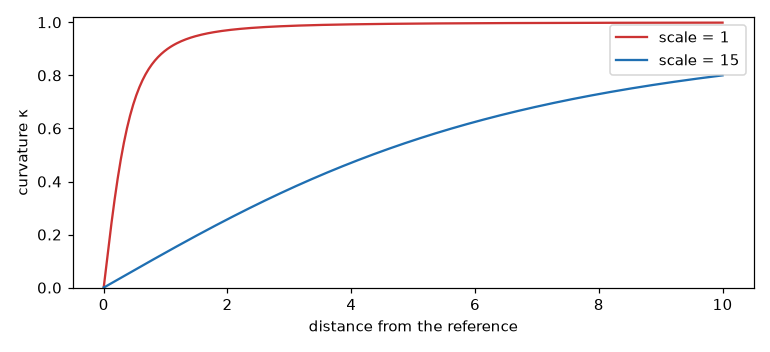

# Curvature

`curvature(x, ref, scale)` answers one question with one number in `[0, 1)`: **how far is
`x` from `ref`, in the physical units of the problem?** It is not an anomaly detector;
it is a bounded proximity score, useful when "getting close" is itself the thing you
want to measure.

`Orca`'s input shield uses it internally to size the current deviation.

## The signal

The same 100 Hz joint velocity. Here `ref` is the nominal velocity 0.5 rad/s, and `x` is
the current sample.

```python
x_now = 2.5
x_ref = 0.5
```

## 1. Basic use

```python
x_now = 2.5
x_ref = 0.5
import jax.numpy as jnp
from dense_armor.anomaly.curvature import curvature

curvature(jnp.array([x_now]), jnp.array([x_ref]))
```

At the default `scale = 1.0` this returns a value close to 1: two rad/s away from the
reference is "far" at that scale.

## 2. With the right scale

The default `scale = 1.0` is a place-holder. Set `scale` to the width of the zone you
actually care about, in the *same units as the input*. For a joint velocity where "close"
means "within 2 rad/s of nominal":

```python
x_now = 2.5
x_ref = 0.5
import jax.numpy as jnp
from dense_armor.anomaly.curvature import curvature

curvature(jnp.array([x_now]), jnp.array([x_ref]))
curvature(jnp.array([x_now]), jnp.array([x_ref]), scale=2.0)
```

Five units away from the reference is now only partway into a 2-unit zone. The score
comes back closer to the middle of the range instead of near 1.



## The formula, symbol by symbol

Let `d = x − ref` and let `scale` be the width of the zone. Define
`g = 2·d / scale`, then:

```
κ(d) = √(g² + δ) / √(1 + g² + δ)
```

with `δ` a small positive constant (default 1e-9, a numerical guard). `κ` is
**0 at d = 0**, **increases smoothly** as `|d|` grows, and **saturates to 1** for
`|d| ≫ scale`. `δ` keeps the function away from exactly 0 and 1 so gradients stay finite.

## Hand cases

Distance `d = 0.5` from the reference.

- At `scale = 1.0`: `g = 2·0.5 / 1 = 1`, `κ = √(1) / √(2) = 0.7071`.
- At `scale = 15.0`: `g = 2·0.5 / 15 = 0.0667`, `κ = √(0.00444) / √(1.00444) = 0.0665`.

At the default `scale = 1.0`, a distance of half a unit already gives 0.71 — nearly
saturated. At `scale = 15.0`, the same distance gives 0.07 — the zone extends 15 units,
so half a unit is barely into it. **The `scale` argument is what makes the score mean
something in the units of the problem.**

## API reference

::: dense_armor.anomaly.curvature

---

## Details

`scale` defaults to `1.0` so the function is backward compatible: `Orca`'s existing call
site (`orca.py`, `curvature(fh, c_chunk)`) is unaffected.

This parameter was added after checking a claim that `curvature` could work as a
joint-limit-feasibility check, against real SO-101 joint data. The real robot does press
against its physical limits during real pick-place episodes (`elbow_flex`, 120/303 real
frames at its true hard-stop, a few degrees past the reference URDF's declared limit,
consistent with normal manufacturing tolerance on that one unit). But at the default
scale, the raw formula saturated to ≈ 1 within about 5 raw units of any reference
regardless of the caller's physical units: as a joint-limit signal in real degrees it was
a near-binary near/far indicator, not a graded one. Correlation with raw distance was
only 0.235 on `elbow_flex`'s real 0.1–66.9 degree range, rising to 0.932 at `scale=15.0`.

**See also**: [Rate limiter](../control/rate_limiter.md) and
[CBF filter](../control/cbf_filter.md) — if the real goal is bounding or correcting a
command near a limit, not just scoring proximity to one, those modules are the right tool.
