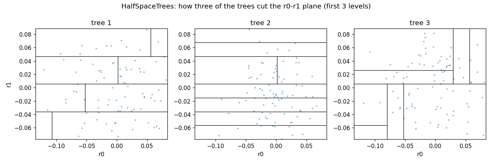
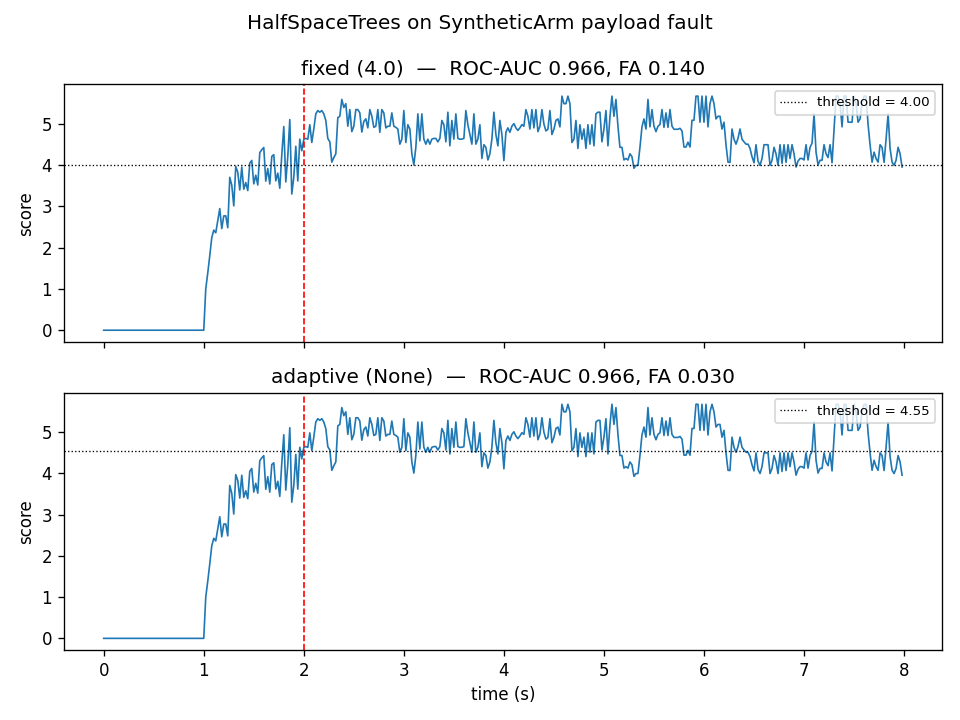

# Half-Space Trees

Half-Space Trees score each sample by how sparse the region of space around it is. In a
control loop they answer one question per joint reading: does this torque residual come from
a part of the space we usually see, or from a region we almost never visit?

## What it is

A robot's torque residual is the difference between the torque the motors actually deliver
and the torque the URDF model predicts. On a healthy joint this residual is small, always
in the same range. When the payload changes, or a gear wears, or a cable slackens, the
residual moves to a range the model has never seen. The task is to notice the move.

Half-Space Trees look at the residual of every joint at once, as one point in a
`d`-dimensional space. They split that space with random axis-parallel cuts — a cut at
`r2 = 0.05`, another at `r0 = -0.1`, and so on — and count how often a sample falls on
each side. The regions where samples rarely fall are the anomalies: a payload fault on the
arm moves the residual to a region the healthy run never visited, and the counter there
stays low.

## How it works

The detector keeps an ensemble of `n_trees` complete binary trees, each `depth` levels
deep. Every tree owns the same domain — the working range of each feature — but each tree
cuts it at different random mid-points. The deeper the tree, the finer the grid.

For one tree, a sample falls into exactly one leaf. The score of the sample on that tree is

    s_tree = -log2( (c_leaf + 1) / (N + 1) )

where `c_leaf` is the number of recent samples whose path ended at the same leaf, and `N`
is the total number of samples in the sliding window. A leaf visited rarely has `c_leaf`
small, so `s_tree` is large. A leaf visited by many samples has `s_tree` close to zero.

The score of the sample is the mean of `s_tree` over the trees. High means anomalous.

The `+ 1` on both sides of the ratio keeps the score finite when a leaf is empty
(`c_leaf = 0`) and when the window is empty (`N = 0`). With `window = 200` and an empty
leaf, the score saturates at `log2(201) ~= 7.65`; with a leaf visited by half the window,
it drops to `log2(2) = 1`.

The implementation follows the description of Half-Space Trees in Leveni et al. (2024),
section 3: an ensemble of complete binary trees, each split on a random dimension at the
mid-point of the current node's range, scored from node masses. The original algorithm is
Tan et al. (2011).

The three trees own the same plane but cut it differently: different dimensions, different
positions, different first levels. A sample falls into one leaf per tree. The mean depth
across the trees, mapped through `-log2`, is the score.

## Smallest example

~~~python
import numpy as np
from dense_armor.utility.anomaly.hst import HalfSpaceTrees

rng = np.random.default_rng(0)
det = HalfSpaceTrees(n_trees=15, depth=8, window=100, range_init=10, seed=0)

for _ in range(200):
    det.learn_one({
        "a": float(rng.normal(0.0, 0.05)),
        "b": float(rng.normal(0.0, 0.05)),
    })

print(f"healthy  {det.score_one({'a': 0.0, 'b': 0.0}):.3f}")
print(f"anomaly  {det.score_one({'a': 10.0, 'b': 10.0}):.3f}")
~~~

The first score is close to zero: the point sits where the healthy samples sit. The second
is close to `log2(101) ~= 6.7`: the point falls in a leaf the healthy samples never
visited.

## On a real arm

The residual of joints 1-4 on a `SyntheticArm` payload fault. The fault (5 kg added at
t = 2 s) shifts the residual on joints 1-5 by tens of N·m; the healthy run stays within
±0.15 N·m.

~~~python
from pathlib import Path
import numpy as np
from dense_armor.utility.anomaly.hst import HalfSpaceTrees
from dense_armor.utility.datasets import SyntheticArm

ds = SyntheticArm(
    Path("test/fixtures/urdf/panda.urdf"),
    period_s=2.0, rate_hz=50.0, n_cycles=4,
    fault_at_s=2.0, fault="payload", payload_mass=5.0,
    noise_std=(1e-3, 5e-3, 5e-2), seed=0,
)

det = HalfSpaceTrees(
    n_trees=25, depth=8, window=200, range_init=50,
    feature_keys=["r0", "r1", "r2", "r3"], threshold=None, seed=0,
)

for sig, _ in ds.stream():
    q, qd, qdd = ds.trajectory(sig.t)
    tau_nom = ds.nominal_torque(q, qd, qdd)
    x = {f"r{j}": float(sig[f"tau_{j}"] - tau_nom[j]) for j in range(4)}
    _ = det.score_one(x)
    _ = det.learn_one(x)
~~~

The top panel uses a fixed threshold of `4.0`. The bottom uses the adaptive threshold: a
quantile of the last 500 scores, with the detector deciding itself where to put the line.
Both score the fault (the red dotted line at t = 2 s) above their own threshold on
almost every post-fault sample, and both leave the healthy part below.

## Numbers

`SyntheticArm` (400 samples, 100 healthy, 300 fault) and `DriftStream` (2000 samples, one
sudden drift at half), feature ranges calibrated on the healthy part with a 10 % margin.

| Stream | threshold | ROC-AUC | False alarms on the healthy part |
|---|---|---|---|
| SyntheticArm | fixed 4.0 | 0.966 | 0.140 |
| SyntheticArm | adaptive quantile 0.95 | 0.966 | 0.030 |
| DriftStream | fixed 4.0 | 0.934 | 0.350 |

The adaptive threshold costs a small amount of warm-up (it uses the 500 most recent
scores) and takes the false-alarm rate on the healthy part from 14 % to 3 % on the arm.
Both thresholds leave the ROC-AUC unchanged: they only decide where to place the line.

## Details

### Where the rules come from

Leveni et al. (2024) describe Half-Space Trees in section 3 as the streaming alternative
their method compares to: complete binary trees, mid-point splits of the current range,
node masses as the score. The original algorithm is Tan, Ting and Liu (2011), *Fast
anomaly detection for streaming data*, IJCAI.

The working range of each feature, the exact sliding-window policy, the count on both
sides of the ratio and the score's `-log2` are this module's choices. The paper describes
the shape of the method (ensemble, mid-point splits, node masses), not the numbers.

### Choices stated explicitly

- **Working range.** When `feature_ranges` is given, the trees start from it. When it is
  `None`, the first `range_init` samples set it (min and max per feature, with a 10 %
  margin). Points outside the learned range are not clipped: they land in the outermost
  leaf on that side, which is the rarest region — exactly what an anomaly looks like.
- **Fixed depth.** The trees are complete and their depth is fixed at construction. The
  splits are at the mid-point of the current node's range, which depends only on the
  node's position in the tree (its BFS index), not on the data.
- **Sliding window.** The forgetting is an exact window of the last `window` samples, kept
  as a circular buffer of leaf paths. When a sample leaves the window, the counts along
  its path decrease by one. No periodic retraining: the window itself is the forgetting.
- **Score.** `mean(-log2((c_leaf + 1) / (N + 1)))` over the trees, with `+1` on both sides
  to keep empty leaves and empty windows finite.
- **Threshold.** `None` means adaptive: the `threshold_quantile`-quantile (default 0.95) of
  the last `threshold_window` scores (default 500); until `threshold_warmup` scores
  (default 50) have been seen the effective threshold is `1e9`, so nothing is flagged. A
  float means fixed.

### Measured cost

At `n_trees=25, depth=8, window=200`, on one CPU thread:

- `0.42 ms` per sample for `learn_one` + `score_one` on the arm stream;
- memory flat: `25 * (2^9 - 1)` counters + `window * depth` paths, independent of the
  stream length.

The `budget_s` declared by the class is `0.06 s` (the measured p99 of `learn_one`, tens of
times above the real per-sample cost, so the check tolerates the jitter of a CI runner).

### What the detector does not do

It counts, it does not model. Two different fault shapes that land in the same leaf give
the same score. When the anomaly is a change in the *shape* of the distribution rather
than a shift to a rarer region, the score may stay low. [LODA](loda.md) and
[OnlineRobustMahalanobis](mahalanobis.md) target those cases.
