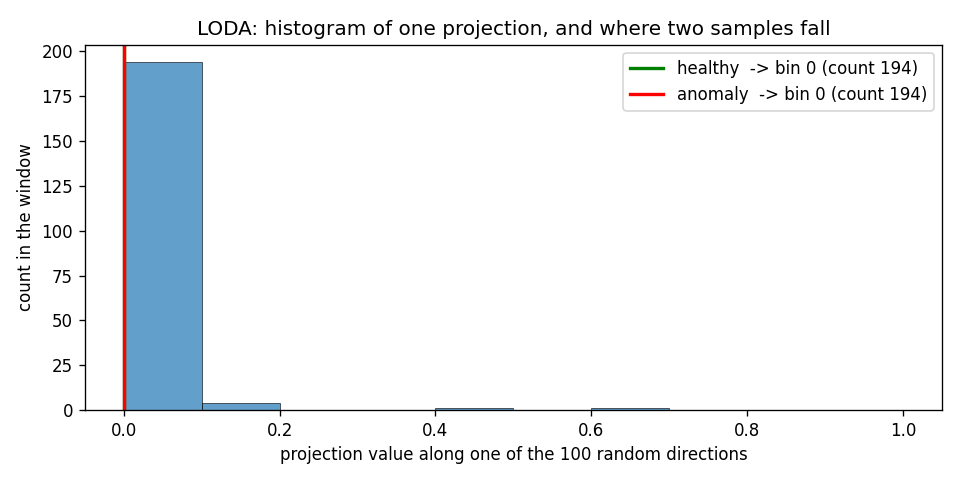
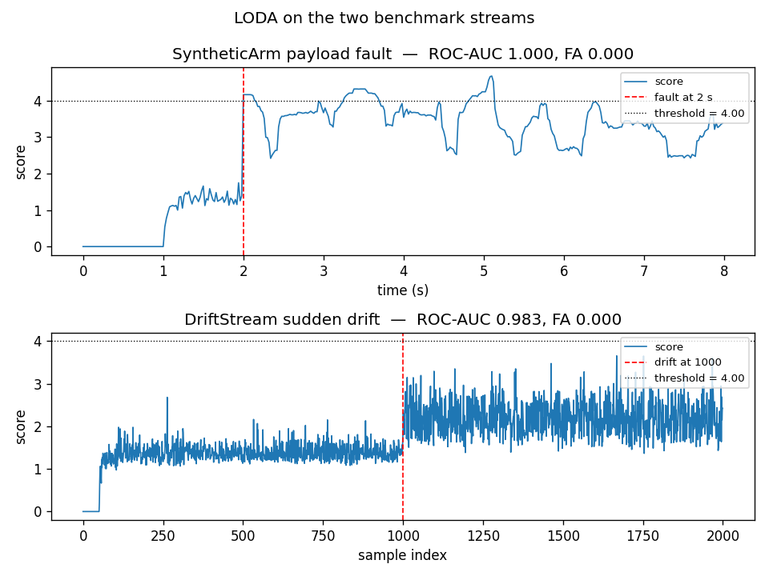

# LODA

LODA scores each sample by how rare its position is in a few random one-dimensional
projections of the joint residual. In a control loop it answers one question per reading:
does this residual land in a part of the space the healthy run almost never visits?

## What it is

A robot produces, per joint, a torque residual — the difference between the measured torque
and the torque the URDF model predicts. On a healthy arm this residual stays within a
narrow band. When something changes (a payload, a worn bearing, a slack cable), the
residual moves to a region of the `d`-dimensional joint space that the healthy arm rarely
or never visits.

LODA looks at each joint-space point through many random 1-D projections: it draws a
direction, projects every sample onto it, and histograms the projection values over a
sliding window. A sample that falls in a bin the window rarely visits gets a high anomaly
score. Averaging the score across the projections gives the final number.

The idea is that some fault directions are visible in one projection and invisible in
another. A single histogram over the raw `d`-dimensional space would need an exponential
number of bins; `d`-dimensional histograms over many 1-D projections need a linear number.

## How it works

For each of `n_projections` random directions `w_j`, the detector computes a 1-D value

    proj_j = <w_j, (x - lo) / (hi - lo)>

where `lo` and `hi` are the working ranges of the features (learned from the first
`range_init` samples, or given as `feature_ranges`). The projection is clipped to `[0, 1]`
and mapped to one of `n_bins` histogram bins, whose counts are updated every sample inside
a sliding window of the last `window` samples.

The score of a sample is the mean over the projections of

    -log2( (c_bin + 1) / (N + 1) )

where `c_bin` is the count in the bin the projection falls into, and `N` is the total
number of samples currently in the window. A rare bin (`c_bin = 0`) gives a high score; a
common one gives a low score.

The projections are sparse: each `w_j` has only `max(1, d // 2)` non-zero entries, so a
projection mixes only half of the features. Different projections mix different subsets,
which gives the ensemble its diversity.

The `+ 1` on both sides of the ratio keeps the score finite on empty bins and empty
windows. With `window = 200` and an empty bin, the score saturates at `log2(201) ~= 7.65`.

The implementation follows Lou et al. (2024), fSEAD, section on Loda: random projection of
the input, one histogram per projection, score `-mean(log2(c / W))`. The original LODA
paper is Pevny (2016).

One of the hundred projections. The blue bars are the counts of the sliding window; the
green line is where a healthy sample falls; the red line is where an out-of-distribution
sample falls. The healthy one lands in a bin with hundreds of samples, the anomaly in a
bin the window never visits.

## Smallest example

~~~python
import numpy as np
from dense_armor.utility.anomaly.loda import LODA

rng = np.random.default_rng(0)
det = LODA(n_projections=50, n_bins=10, window=200, range_init=50, seed=0)

for _ in range(300):
    det.learn_one({
        "a": float(rng.normal(0.5, 0.05)),
        "b": float(rng.normal(0.5, 0.05)),
    })

print(f"healthy      {det.score_one({'a': 0.5, 'b': 0.5}):.3f}")
print(f"far outlier  {det.score_one({'a': 5.0, 'b': 5.0}):.3f}")
~~~

The first score is low: the point sits where the healthy samples sit. The second is close
to the saturation value: the point falls in bins the healthy run rarely or never visited.

## On a real arm

The residual of joints 1-4 on a `SyntheticArm` payload fault. The fault (5 kg added at
t = 2 s) shifts the residual on joints 1-5 by tens of N·m; the healthy run stays within
±0.15 N·m.

~~~python
from pathlib import Path
from dense_armor.utility.anomaly.loda import LODA
from dense_armor.utility.datasets import SyntheticArm

ds = SyntheticArm(
    Path("test/fixtures/urdf/panda.urdf"),
    period_s=2.0, rate_hz=50.0, n_cycles=4,
    fault_at_s=2.0, fault="payload", payload_mass=5.0,
    noise_std=(1e-3, 5e-3, 5e-2), seed=0,
)

det = LODA(
    n_projections=100, n_bins=10, window=200, range_init=50,
    feature_keys=["r0", "r1", "r2", "r3"], threshold=4.0, seed=0,
)

for sig, _ in ds.stream():
    q, qd, qdd = ds.trajectory(sig.t)
    tau_nom = ds.nominal_torque(q, qd, qdd)
    x = {f"r{j}": float(sig[f"tau_{j}"] - tau_nom[j]) for j in range(4)}
    _ = det.score_one(x)
    _ = det.learn_one(x)
~~~

Top: SyntheticArm, the fault shifts the residual to bins the healthy run never visited.
Bottom: `DriftStream` with one sudden drift at the half of the stream. Both score the
change above the threshold (4.0) on nearly every post-change sample, with no false alarms
on the healthy part.

## Numbers

`SyntheticArm` (400 samples, 100 healthy, 300 fault) and `DriftStream` (2000 samples, one
sudden drift at half), feature ranges calibrated on the healthy part with a 10 % margin.

| Stream | threshold | ROC-AUC | False alarms on the healthy part |
|---|---|---|---|
| SyntheticArm | 4.0 | 1.000 | 0.000 |
| DriftStream | 4.0 | 0.983 | 0.000 |

The two streams are the same used for every other detector on this page. LODA is the
second-fastest detector in the comparison (`0.16 ms` per sample at the arm's parameters)
and the second most accurate on the arm after `OnlineRobustMahalanobis`.

## Details

### Where the rules come from

Lou et al. (2024) describe Loda in section 2.1 as one of the three streaming ensemble
detectors the fSEAD library supports: random projection, one histogram per projection,
score `-mean(log2(c / W))`. The original algorithm and the sparse random projection are
from Pevny (2016), *LODA: Lightweight on-line detector of anomalies*, Machine Learning
102(2).

The number of non-zero entries per projection (`max(1, d // 2)`) and the range learning
policy are this module's choices. The paper does not fix them.

### Choices stated explicitly

- **Projection.** Sparse random Gaussian vector with `k` non-zero entries, chosen uniformly
  without replacement, L2-normalised. `k = max(1, d // 2)` by default. The paper writes
  `-log2(v)`; the sign is inverted here so that a high score means anomalous, the
  convention of `AnomalyDetector`.
- **Histogram.** Fixed bin edges on `[0, 1]` after min-max normalisation. When
  `feature_ranges` is `None`, the first `range_init` samples set the range (min and max
  per feature, with a 10 % margin). Points outside are clipped to `[0, 1]`: they land in
  the outermost bin on that side, which is the rarest region.
- **Score.** `mean(-log2((c + 1) / (W + 1)))` over the projections. The `+ 1` on both
  sides smooths empty bins and empty windows, so the score stays finite.
- **Threshold.** A single float (default 4.0), because the score is bounded in
  `[0, log2(window + 1)]` and the natural flagging level depends on the window size. No
  adaptive quantile here: the score is already a log-likelihood.

### Measured cost

At `n_projections=100, n_bins=10, window=200`, on one CPU thread:

- `0.16 ms` per sample for `learn_one` + `score_one` on the arm stream;
- memory flat: `100 * 10` counters + `window * n_projections` bin indices, independent of
  the stream length.

The `budget_s` declared by the class is `0.002 s`.

### What the detector does not do

It counts bins, it does not model the joint distribution. A fault that moves the residual
along a direction that no projection sees can hide. `n_projections` and `n_bins` trade
accuracy for cost: with ten projections and four bins the score is noisy; with five
hundred and thirty-two it is stable but costs proportionally. The defaults target a few
hundred samples per window.

[OnlineRobustMahalanobis](mahalanobis.md) is the alternative when the fault is a shift of
the mean rather than a rare bin.
