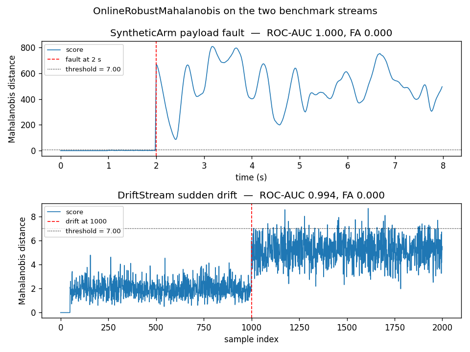
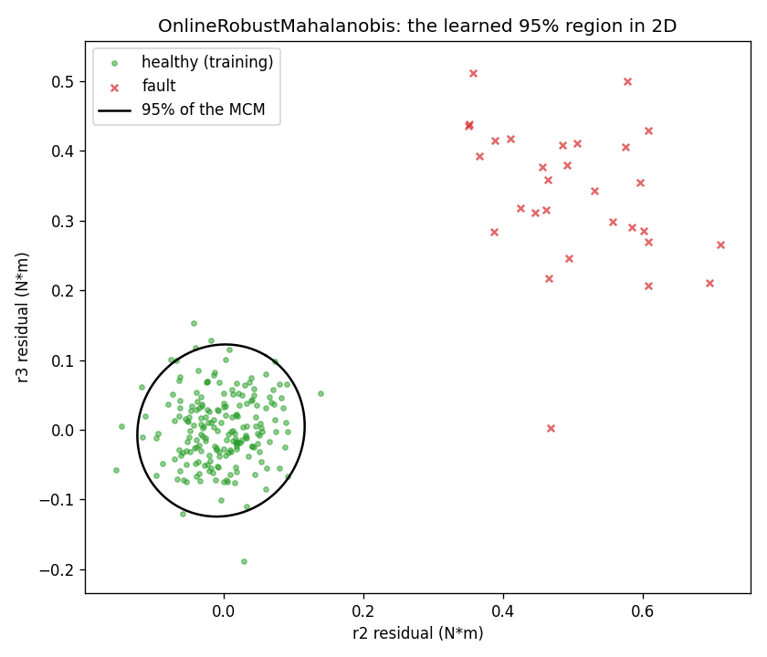

# Online Robust Mahalanobis

Online Robust Mahalanobis scores each sample by how far it is from the centre of the
healthy joint residual, measured in units of the residual's own spread. In a control loop
it answers one question per reading: how many standard deviations of the healthy
distribution away is this point, in the joint-space metric the healthy arm actually has?

## What it is

The healthy residuals of a robot joint form a cloud around zero. Its shape is not a
sphere: the joints are correlated, and a fault along one direction costs more than a fault
along another. The classical way to measure distance in this cloud is the Mahalanobis
distance: subtract the mean, divide by the covariance, take the Euclidean norm of the
result. A sample that is far in *units of its own distribution* is anomalous.

The classical estimator uses the sample mean and the sample covariance. Both are sensitive
to outliers. A single extreme sample can drag the mean far from the cloud, and inflate the
covariance along its own direction so much that the same outlier looks normal under the
new metric — the *masking* effect. Robust estimates of location and scatter fix this.

This module uses the geometric median for location and the median covariation matrix
(MCM) for scatter. Both are `50 %` breakdown estimators: half the samples must be corrupted
before the estimate moves, against one outlier for the mean. Both are estimated online by
averaged stochastic gradient (ASGD), one sample at a time.

The score of a sample is the Mahalanobis distance under the current MCM:

    D(x) = sqrt( sum_j (1 / delta_j) * <x - m_bar, P_j>^2 )

where `m_bar` is the current location estimate, `P_j` is the j-th eigenvector of the
averaged MCM `V_bar`, and `delta_j` the corresponding eigenvalue. The sum is over the `d`
eigenvalues: it is the Mahalanobis distance written without inverting the matrix, using
the eigendecomposition instead.

## How it works

Two running estimates are maintained. `m` tracks the geometric median, `V` tracks the MCM.
Both are updated by averaged stochastic gradient, one sample at a time.

For the geometric median, the paper's recurrence is

    m_{n+1}     = m_n + gamma_{n+1} * (X_{n+1} - m_n) / ||X_{n+1} - m_n||
    m_bar_{n+1} = m_bar_n + (1 / (n + 2)) * (m_{n+1} - m_bar_n)

The first line is a stochastic gradient step toward the sample, normalised so that every
step has the same length. The normalisation is the robustness: a distant sample moves `m`
by at most `gamma_{n+1}`, no matter how far it is. The second line averages the iterates,
which accelerates convergence (Cardot, Cénac and Zitt 2013).

For the MCM, the same shape:

    V_{n+1}     = V_n + gamma_{n+1} * (outer_{n+1} - V_n) / ||outer_{n+1} - V_n||_F
    V_bar_{n+1} = V_bar_n + (1 / (n + 2)) * (V_{n+1} - V_bar_n)

with `outer_{n+1} = (X_{n+1} - m_bar_n) (X_{n+1} - m_bar_n)^T` the centred outer product of
the new sample. The gradient is again normalised, this time to unit Frobenius norm.

The step size is

    gamma_n = c_gamma * (n + n0) ** (-gamma_exp)

with `gamma_exp` in `(1/2, 1)` for convergence (Cardot and Godichon-Baggioni 2017).

The first `n_init` samples are not used for the ASGD updates. They are kept in a small
buffer and used to compute an initial estimate of the location and scatter, from which the
ASGD starts. Without the initialisation the ASGD gradients, whose scale is unit and not
the scale of the data, would never reach the data.

## Smallest example

~~~python
import numpy as np
from dense_armor.utility.anomaly.mahalanobis import (
    OnlineRobustMahalanobis,
)

rng = np.random.default_rng(0)
det = OnlineRobustMahalanobis(feature_keys=["a", "b"], n_init=200)

for _ in range(500):
    x = rng.standard_normal(2)
    det.learn_one({"a": float(x[0]), "b": float(x[1])})

print(f"healthy  {det.score_one({'a': 0.0, 'b': 0.0}):.3f}")
print(f"far      {det.score_one({'a': 10.0, 'b': 10.0}):.3f}")
~~~

The healthy point sits at the centre of the cloud. Under a standard bivariate Gaussian its
Mahalanobis distance is small; the score here is close to zero. The far point is ten units
away along both axes: the distance is large, and the score reflects that. The default
`threshold` of `7.0` is the classical value for low-dimensional Gaussians.

## On a real arm

The residual of joints 1-4 on a `SyntheticArm` payload fault. The fault (5 kg added at
t = 2 s) shifts the residual on joints 1-5 by tens of N·m; the healthy run stays within
±0.15 N·m.

~~~python
from pathlib import Path
from dense_armor.utility.anomaly.mahalanobis import (
    OnlineRobustMahalanobis,
)
from dense_armor.utility.datasets import SyntheticArm

ds = SyntheticArm(
    Path("test/fixtures/urdf/panda.urdf"),
    period_s=2.0, rate_hz=50.0, n_cycles=4,
    fault_at_s=2.0, fault="payload", payload_mass=5.0,
    noise_std=(1e-3, 5e-3, 5e-2), seed=0,
)

det = OnlineRobustMahalanobis(
    n_init=50,
    feature_keys=["r0", "r1", "r2", "r3"],
    threshold=7.0,
)

for sig, _ in ds.stream():
    q, qd, qdd = ds.trajectory(sig.t)
    tau_nom = ds.nominal_torque(q, qd, qdd)
    x = {f"r{j}": float(sig[f"tau_{j}"] - tau_nom[j]) for j in range(4)}
    _ = det.score_one(x)
    _ = det.learn_one(x)
~~~

Top: SyntheticArm. The fault sends the score past 100 in the first few samples after
t = 2 s, then the score drops as the ASGD updates the location and the scatter estimate
towards the new distribution — but the detector has already flagged every post-fault
sample until the update catches up. Bottom: `DriftStream`. The score rises cleanly at the
drift and stays above the threshold.

## The learned 95 % region

The Mahalanobis distance is a scalar, but the metric it uses is a `d`-dimensional ellipsoid.
Plotting it in two dimensions makes the shape visible.

Two joints' residuals, first 200 samples of healthy training (green dots), then 30 fault
samples (red crosses). The black ellipse is the 95 % quantile of the MCM currently
estimated: a new sample inside the ellipse has Mahalanobis distance below `chi2_2(0.95)`,
outside it is flagged. The fault samples all fall outside.

## Numbers

`SyntheticArm` (400 samples, 100 healthy, 300 fault) and `DriftStream` (2000 samples, one
sudden drift at half), feature ranges calibrated on the healthy part with a 10 % margin.

| Stream | threshold | ROC-AUC | False alarms on the healthy part |
|---|---|---|---|
| SyntheticArm | 7.0 | 1.000 | 0.000 |
| DriftStream | 7.0 | 0.994 | 0.000 |

On both streams the detector separates the two populations perfectly, with no false
alarms. It is the most accurate of the five detectors on this repository's benchmarks and
the second fastest (`0.045 ms` per sample at the arm's parameters).

## Details

### Where the rules come from

Guillot, Godichon-Baggioni and Robin (2025) introduce the online median and MCM in
Section 3. The recurrence for the geometric median is equation 8, for the MCM equation 10.
The Mahalanobis distance under the MCM is equation from Section 2.2. The step size
`gamma_n = c * n ** -gamma` with `gamma` in `(1/2, 1)` is from Cardot, Cénac and Zitt
(2013) and Cardot and Godichon-Baggioni (2017).

The paper's full method also reconstructs the eigenvalues of the true covariance from the
MCM by a Robbins-Monro scheme (equations 4-5) and scales the distances by
`chi2_d(0.5) / med(D_1..n)` (equation 1). Neither step is implemented here.

### Choices stated explicitly

- **Offline initialisation.** The geometric median is initialised by the Weiszfeld
  algorithm (Guillot et al. 2025, equation 6). The MCM is initialised by the empirical
  average of the centred outer products, not the Weiszfeld offline MCM of Section A.2:
  with `n_init` of tens of samples the average is more stable than the Weiszfeld iteration,
  which for small samples can converge to a rank-one solution. The online ASGD refines the
  estimate as soon as new samples arrive.
- **Step length cap.** A `max_step_frac` cap on the ASGD step (default 0.1) prevents a
  single large sample from moving `V` by more than a fraction of its own norm. Without the
  cap, `c_gamma = 1` and `gamma_exp = 0.7` can move `V` by 1 in Frobenius norm in one
  step, much larger than the scale of the data, and the average oscillates through zero.
  This is a numerical safeguard, not part of the paper.
- **Eigenvalue floor.** Every eigenvalue of `V_bar` is floored at `trace(V_bar) / d * 1e-3`.
  The floor keeps the score bounded when the ASGD first steps drive `V` through zero,
  without changing the shape of the metric. Also a numerical safeguard.
- **No chi-squared scaling.** The paper's equation 1 divides the distances by the median of
  the past distances, so that the calibrated threshold is the median of a `chi2_d`
  distribution. This module does not apply the scaling: the threshold is the one the user
  calibrates, and the default `7.0` is the classical value for low-dimensional Gaussians.
- **Threshold.** A fixed float, default `7.0`.

### Measured cost

At `n_init=50` and 4 features, on one CPU thread:

- `0.045 ms` per sample for `learn_one` + `score_one` on the arm stream;
- memory flat: `d + d^2` arrays, independent of the stream length.

The `budget_s` declared by the class is `0.005 s`.

### The bug the module fixes

An earlier version of this module produced scores in the thousands on the arm's healthy
residuals. The cause: no offline initialisation. The ASGD gradients are unit-norm
normalised, so starting from the identity matrix they never reached the scale of the data
(the healthy residual is ~0.15 N·m, the identity has unit diagonal), and the ratio
`<x - m_bar, P_j>^2 / delta_j` grew without bound.

The fix is the offline initialisation described above: the first `n_init` samples estimate
the location and the scatter at the right scale, and the ASGD starts from there. On the
same 40 healthy residuals the score now stays below the threshold. The reproduction is
the module's test
`test_mahalanobis_healthy_scores_stay_below_threshold`, which asserts the maximum over the
healthy samples is below `7.0`.

[OCSVM](ocsvm.md) is the alternative when the fault is not a shift but a change of the
distribution's shape.
