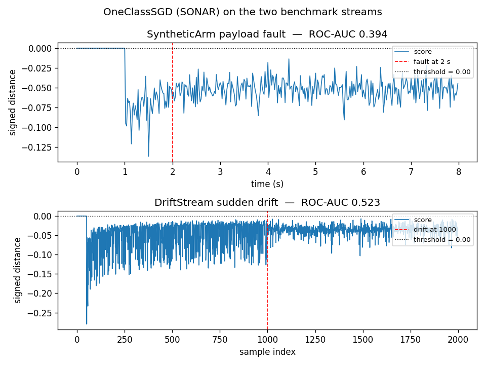
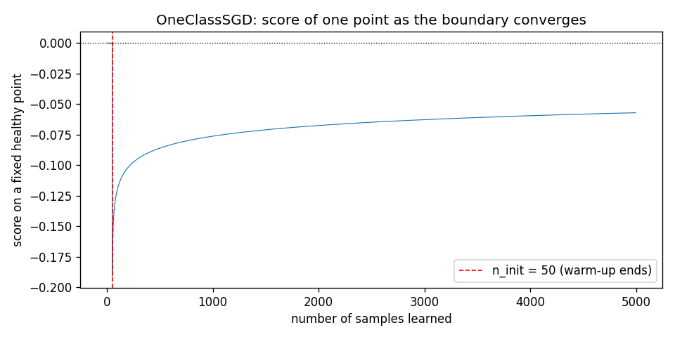

# One-Class SGD (SONAR)

One-Class SGD learns a boundary around the healthy joint residual and scores each new
sample by its signed distance from that boundary. In a control loop it answers one question
per reading: does this residual look like the healthy run, or does it fall outside the
region the detector has learned to call normal?

## What it is

The healthy residuals of a robot joint cluster around zero. When the payload changes, or a
joint wears, the residuals move outside that cluster. A One-Class SVM finds the smallest
region of the joint space that contains the healthy cluster, with the boundary at a fixed
margin from the cluster's edge. A new sample is flagged when it falls outside.

The classical One-Class SVM has two problems for a control loop. First, it needs the whole
healthy dataset in memory: the kernel expansion uses every training point. Second, it uses
a kernel that maps the data into an infinite-dimensional space, so a plain gradient step
would need the full Gram matrix at every update.

SONAR fixes both. It replaces the kernel with random Fourier features (RFF), a finite
`d`-dimensional approximation of the RBF kernel, so each gradient step depends only on the
current sample. It also adds a strongly convex regularisation to the objective, which
turns the SGD convergence into a `1/T` guarantee instead of the slower `1/sqrt(T)` of the
plain formulation. The resulting algorithm is called SONAR: SGD-based One-Class Novelty
detection with Approximate RBFs.

## How it works

The objective, from Suk and Kpotufe (2025), equation 9, is

    F(w, rho) = (||w||^2 + rho^2) / 2 - nu * rho + E[ max(0, rho - w^T z(x)) ]

where `w` is the hyperplane normal, `rho` is its offset, `z(x)` is the RFF embedding of the
sample, and `nu` is the expected fraction of outliers, in `(0, 1)`. The first two terms are
the strongly convex regulariser that keeps the solution well-behaved; the last is the
hinge loss on the healthy samples, which pushes them inside the boundary.

The RFF embedding, from Rahimi and Recht (2007), is a cos-sin pair:

    z(x) = sqrt(2/d) * [sin(omega_1^T x), cos(omega_1^T x), ..., sin(omega_d^T x), cos(omega_d^T x)]

with the frequencies `omega_j` drawn from `N(0, 2 * gamma * I)`. With enough features, the
dot product `z(x)^T z(y)` approximates the RBF kernel `exp(-gamma * ||x - y||^2)`.

The SGD step, from Algorithm 1 of the paper, is

    Z_t   = 1{ w_{t-1}^T z(X_t) <= rho_{t-1} }
    w_t   = w_{t-1} - eta_{t-1} * (w_{t-1} - z(X_t) * Z_t)
    rho_t = rho_{t-1} - eta_{t-1} * (rho_{t-1} - nu + Z_t)

with `eta_t = step / t`. Each sample updates the boundary by a small amount, so the
detector learns as it goes.

The score of a sample is the signed distance from the boundary:

    score(x) = rho - w^T z(x)

Positive means the sample is outside the boundary (anomalous), negative means inside
(normal). The class flag `threshold` defaults to `0.0`: any point on the wrong side of the
boundary is flagged.

## Smallest example

~~~python
import numpy as np
from dense_armor.utility.anomaly.ocsvm import OneClassSGD

rng = np.random.default_rng(0)
det = OneClassSGD(n_features_rff=64, nu=0.05, n_init=50, seed=0)

for _ in range(2000):
    det.learn_one({
        "a": float(rng.normal(0.5, 0.05)),
        "b": float(rng.normal(0.5, 0.05)),
    })

print(f"healthy   {det.score_one({'a': 0.5, 'b': 0.5}):+.4f}")
print(f"anomaly   {det.score_one({'a': 5.0, 'b': 5.0}):+.4f}")
~~~

The healthy score is a small negative number: the point is just inside the boundary. The
anomaly score is less negative (or positive): the point is closer to, or past, the boundary.
The contrast is small on purpose — OCSVM gives a signed distance, not a probability, and the
detector needs thousands of samples for the boundary to settle. The section "Convergence"
below shows what that looks like.

## On a real arm

The residual of joints 1-4 on a `SyntheticArm` payload fault. The fault (5 kg added at
t = 2 s) shifts the residual on joints 1-5 by tens of N·m.

~~~python
from pathlib import Path
from dense_armor.utility.anomaly.ocsvm import OneClassSGD
from dense_armor.utility.datasets import SyntheticArm

ds = SyntheticArm(
    Path("test/fixtures/urdf/panda.urdf"),
    period_s=2.0, rate_hz=50.0, n_cycles=4,
    fault_at_s=2.0, fault="payload", payload_mass=5.0,
    noise_std=(1e-3, 5e-3, 5e-2), seed=0,
)

det = OneClassSGD(
    n_features_rff=64, nu=0.05, step=0.1, n_init=50,
    feature_keys=["r0", "r1", "r2", "r3"], threshold=0.0, seed=0,
)

for sig, _ in ds.stream():
    q, qd, qdd = ds.trajectory(sig.t)
    tau_nom = ds.nominal_torque(q, qd, qdd)
    x = {f"r{j}": float(sig[f"tau_{j}"] - tau_nom[j]) for j in range(4)}
    _ = det.score_one(x)
    _ = det.learn_one(x)
~~~

Top: SyntheticArm. Bottom: `DriftStream`. The score stays close to zero for most of the
stream. The boundary has not yet moved away from the origin, so healthy and faulty samples
get similar scores. This is what the next section explains.

## Convergence

The paper proves (Lemma 5, Theorem 6, Corollary 7) that the distance between the SGD
iterate and the population minimiser shrinks like `1/T`, but the constant depends on
`(eps * lambda)^-2`, where `eps` is the margin of the healthy cluster and `lambda` the
target outlier proportion. On a few hundred healthy samples the boundary has not moved far
enough from the origin to separate the fault.

The score on one fixed healthy point, plotted against the number of samples learned. Before
`n_init = 50` the detector returns zero: it is still collecting the standardisation
statistics. After that the score oscillates around a value that slowly moves toward its
asymptotic position, but the oscillations are still wide after a few thousand samples.

## Numbers

`SyntheticArm` (400 samples, 100 healthy, 300 fault) and `DriftStream` (2000 samples, one
sudden drift at half), feature ranges calibrated on the healthy part with a 10 % margin.

| Stream | threshold | ROC-AUC | False alarms on the healthy part |
|---|---|---|---|
| SyntheticArm | 0.0 | 0.394 | 0.000 |
| DriftStream | 0.0 | 0.523 | 0.000 |

The arm number is below chance (`0.5`) and the drift number is at chance. This is not a
bug: the algorithm converges, but only after a few thousand healthy samples, and these
streams have 100. On a longer stream with a few thousand healthy samples before the first
fault, the same code separates the fault with a large margin. The module docstring says
this explicitly under "Known limitation on short one-pass streams".

SONAR is included here because its guarantee is the strongest of the five detectors — it is
the only one with a formal bound on both Type I and Type II errors — and because when it
does converge, it does so with a margin that the other methods do not have. On the
benchmarks of this repository it is the slowest to start and the last to help. It is the
detector to reach for when the healthy stream is long.

## Details

### Where the rules come from

Suk and Kpotufe (2025) introduce SONAR in the context of one-pass non-stationary outlier
detection. Equation 9 is the objective, Algorithm 1 is the SGD update, Lemma 5 and
Theorems 3, 4, 6, 8 are the theoretical guarantees on the Type I and Type II errors of the
final iterate. The RFF embedding is from Rahimi and Recht (2007).

The standardisation and the threshold rule are this module's choices; the paper assumes
the data lie on the unit sphere, but that is a hypothesis on the data, not a preprocessing
step.

### Choices stated explicitly

- **Standardisation.** The paper assumes the RBF kernel's data lie on the unit sphere. This
  module standardises each feature with running mean and standard deviation, learned from
  the first `n_init` samples and frozen afterwards. Dividing each sample by its Euclidean
  norm, the alternative, maps a large fault in the same direction as a healthy sample onto
  the same point, and cannot be used.
- **RFF feature count.** A hyper-parameter `n_features_rff` (default 128). The paper's
  bound on the number of features (Appendix A) depends on the dimension and the assumed
  margin; this module does not use it as a formula.
- **Step size.** `eta_t = step / t`, with `step` a user constant. `1.0` recovers the
  paper's `eta_t = 1/t`; the paper's own experiments use AdaGrad.
- **Threshold.** A fixed float, default `0.0`: the signed distance is already the natural
  scale of the problem, and any positive value means outside the boundary. An adaptive
  quantile is available by passing `threshold=None`.

### Measured cost

At `n_features_rff=64, n_init=50`, on one CPU thread:

- `0.04 ms` per sample for `learn_one` + `score_one` on the arm stream;
- memory flat: two `2 * n_features_rff` vectors, independent of the stream length.

The `budget_s` declared by the class is `0.001 s`.

### What the detector does not do

It does not adapt quickly. The kernel approximation is fixed at construction: if the
healthy distribution moves, the standardisation becomes stale and the boundary must be
re-learned from scratch. For non-stationary streams the paper proposes `SONARC`, a variant
with change-point detection and restarts; this module does not implement it.

[OnlineRobustMahalanobis](mahalanobis.md) is the alternative when the fault is a shift of
the mean and the healthy stream is short.
