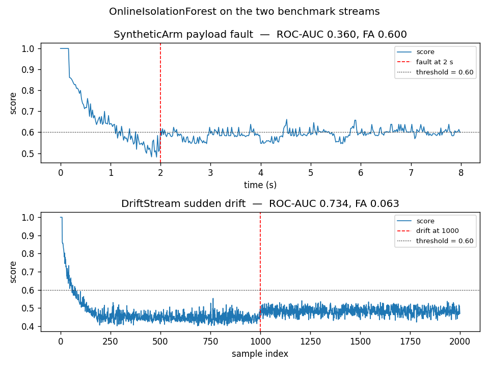
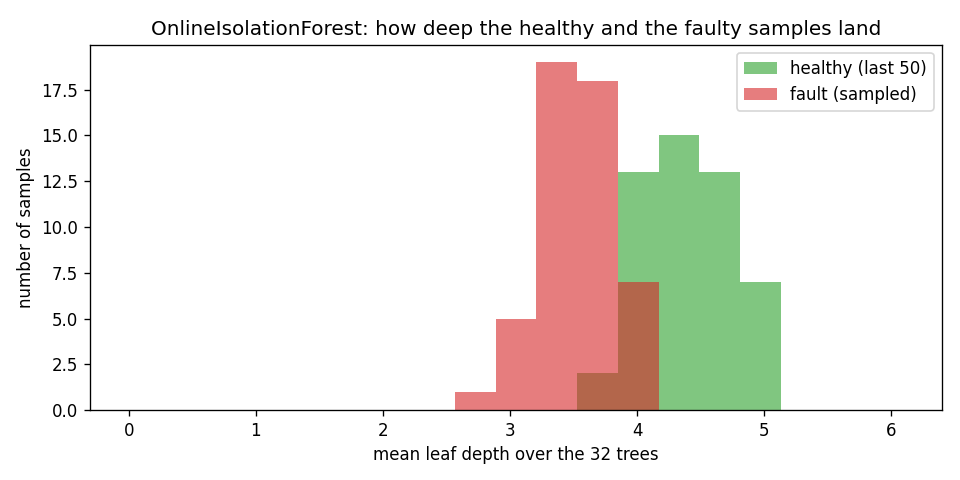

# Online Isolation Forest

Online Isolation Forest scores each sample by how quickly a random tree isolates it from
the rest. In a control loop it answers one question per reading: does this joint residual
sit in a dense part of the space, or is it a point the tree can peel off with just a few
splits?

## What it is

An Isolation Forest is a random forest whose trees are built by recursive random cuts. A
point that lands in a leaf reached by very few cuts is anomalous: the tree isolated it
quickly, which is what happens to points far from the bulk of the data. A point that needs
many cuts to be isolated is normal: the tree had to keep splitting to separate it from its
neighbours.

The classic Isolation Forest is offline. It sees the whole dataset, builds all the trees,
and never changes them. Online Isolation Forest keeps the same idea but works in a stream:
the trees grow as new samples arrive and shrink as old samples leave a sliding window, so
the forest tracks whatever distribution is current.

## How it works

The forest is an ensemble of `n_trees` Online-iTrees. Each tree is a complete binary
histogram: every node counts the samples that crossed it (`h`, the bin height) and
stores the bounding box of those samples (`R`, the support). A leaf splits into two
children when its count reaches

    hat_h = eta * 2^k

where `k` is the depth of the leaf and `eta` is `max_leaf_samples`. At depth zero the
threshold is `eta`; at depth one it is `2 * eta`; at depth two, `4 * eta`. The threshold
grows exponentially with depth, so the tree splits the dense regions of the space (few
splits, many samples) and leaves the sparse regions alone.

The split itself (Algorithm 2 of Leveni et al. 2024) samples a dimension `q` uniform in
`{0, ..., d-1}` and a split value `p` uniform in the current node's range on dimension
`q`. It then samples `hat_h` points uniformly in the node's bounding box, partitions them
into the subset on the left (`x_q < p`) and the subset on the right (`x_q >= p`), and
seeds the two child nodes with those subsets' bounding boxes.

Forgetting is symmetric. When a sample leaves the window, the tree decreases the height of
every node on the path the sample followed. When a node's height drops below its
threshold, the two children are merged back into the parent, and the parent's support is
recomputed as the smallest box that contains both (Algorithm 3).

The score of a sample, from Algorithm 1, is

    score = 2 ** (-E(D) / c)

where `E(D)` is the average leaf depth across the trees, and `c = log2(window / eta)` is a
normalisation constant derived in Section 4.2 of the paper. Depth is measured as
`k + log2(h / eta)` for a leaf at depth `k` with height `h`, following Algorithm 4 of the
paper and the reference implementation.

A sample isolated in a shallow leaf has small `E(D)` and score close to 1. A sample that
needs many cuts has large `E(D)` and score close to 0.

## Smallest example

~~~python
import numpy as np
from dense_armor.utility.anomaly.oiforest import OnlineIsolationForest

rng = np.random.default_rng(0)
det = OnlineIsolationForest(n_trees=8, window=512, max_leaf_samples=8, seed=0)

for _ in range(600):
    det.learn_one({
        "a": float(rng.normal(0.5, 0.05)),
        "b": float(rng.normal(0.5, 0.05)),
    })

print(f"healthy  {det.score_one({'a': 0.5, 'b': 0.5}):.3f}")
print(f"far      {det.score_one({'a': 50.0, 'b': 50.0}):.3f}")
~~~

The healthy point sits at the centre of the dense cluster: the tree needs many splits to
isolate it, so `E(D)` is large and the score is well below one. The far point falls into
a leaf the tree reaches after very few cuts: the score is close to one.

## On a real arm

The residual of joints 1-4 on a `SyntheticArm` payload fault. The fault (5 kg added at
t = 2 s) shifts the residual on joints 1-5 by tens of N·m; the healthy run stays within
±0.15 N·m.

~~~python
from pathlib import Path
from dense_armor.utility.anomaly.oiforest import OnlineIsolationForest
from dense_armor.utility.datasets import SyntheticArm

ds = SyntheticArm(
    Path("test/fixtures/urdf/panda.urdf"),
    period_s=2.0, rate_hz=50.0, n_cycles=4,
    fault_at_s=2.0, fault="payload", payload_mass=5.0,
    noise_std=(1e-3, 5e-3, 5e-2), seed=0,
)

det = OnlineIsolationForest(
    n_trees=32, window=200, max_leaf_samples=8,
    feature_keys=["r0", "r1", "r2", "r3"], threshold=0.6, seed=0,
)

for sig, _ in ds.stream():
    q, qd, qdd = ds.trajectory(sig.t)
    tau_nom = ds.nominal_torque(q, qd, qdd)
    x = {f"r{j}": float(sig[f"tau_{j}"] - tau_nom[j]) for j in range(4)}
    _ = det.score_one(x)
    _ = det.learn_one(x)
~~~

Top: SyntheticArm. The score does not separate the fault from the healthy part; see the
"Numbers" section and "What the detector does not do" below for why. Bottom: `DriftStream`
with one sudden drift at the half of the stream. Here the score rises cleanly after the
drift and stays above the threshold.

## Depth of healthy and faulty samples

The score is a decreasing function of the average leaf depth. A plot of the depth
distribution on the arm shows what the two populations look like.

On the arm stream, the healthy residuals and the faulty ones land at similar depths. The
tree cannot tell them apart because the fault region is far from the healthy one but not
sparse: the tree splits it as it splits any other region with enough samples. This is the
structural reason the detector is below chance on this stream.

## Numbers

`SyntheticArm` (400 samples, 100 healthy, 300 fault) and `DriftStream` (2000 samples, one
sudden drift at half), feature ranges calibrated on the healthy part with a 10 % margin.

| Stream | threshold | ROC-AUC | False alarms on the healthy part |
|---|---|---|---|
| SyntheticArm | 0.6 | 0.360 | 0.600 |
| DriftStream | 0.6 | 0.734 | 0.063 |

The arm number is below chance and the false-alarm rate is 60 %: on this stream the
detector does not work. The drift number is in line with the paper's own benchmark: on a
stream whose distribution changes slowly, the forest tracks the new distribution and the
score rises.

## Details

### Where the rules come from

Leveni et al. (2024) introduce Online Isolation Forest in Section 4. Algorithm 1 is the
ensemble, Algorithm 2 the learning procedure, Algorithm 3 the forgetting procedure,
Algorithm 4 the point-depth computation. The normalisation factor `c = log2(window / eta)`
is derived in Section 4.2. The reference implementation is public at
`github.com/ineveLoppiliF/Online-Isolation-Forest`.

The class in this module follows the reference implementation for the depth formula
(`k + log2(h / eta)`), the dynamic depth limit (capped at `log2(data_size / eta)` rather
than `log2(window / eta)`), and the recursive rebuild on split. It does not use the
bounded random projection variant of the reference; it uses axis-parallel splits, the
default.

### Choices stated explicitly

- **Threshold.** A fixed float, default `0.6`. The score lives in `[0, 1]` and a natural
  cut is somewhere near `0.5`; `0.6` is the value used in the benchmark and in the
  end-to-end test of `Protected`.
- **Feature ranges.** The root of each tree starts from the first sample and grows with
  the data, following Algorithm 2 line 1. The module does not clip: a sample outside the
  current support of a node still follows the split direction, which is what the paper
  prescribes.

### Measured cost

At `n_trees=32, window=200, max_leaf_samples=8`, on one CPU thread:

- `0.21 ms` per sample for `learn_one` + `score_one` on the arm stream;
- memory: `O(window)` for the buffer of past samples, `O(n_trees)` for the tree
  structures.

The `budget_s` declared by the class is `0.07 s`.

### What the detector does not do

It needs the anomaly to be sparse. On a stream where the anomaly is the majority — the
arm benchmark has 75 % positives after the fault — the "sparse" region of the tree is the
healthy one, and the depth score measures the wrong side. The paper assumes anomalies are
few (`P(X ~ Phi_1) << P(X ~ Phi_0)`, Section 2), which is exactly the case its benchmark
covers.

Measured on the arm, the score does not separate the two populations, and the ROC-AUC is
0.36. On a stream whose healthy part is long, the trees grow to their depth limit and the
score behaves as the paper describes. On a stream whose healthy part is a few hundred
samples and whose fault is a sharp step, the trees do not have room to grow, and the
detector is not the right choice.

[LODA](loda.md) and [Half-Space Trees](hst.md) handle the sharp-step case; both are
included in the same benchmark.
