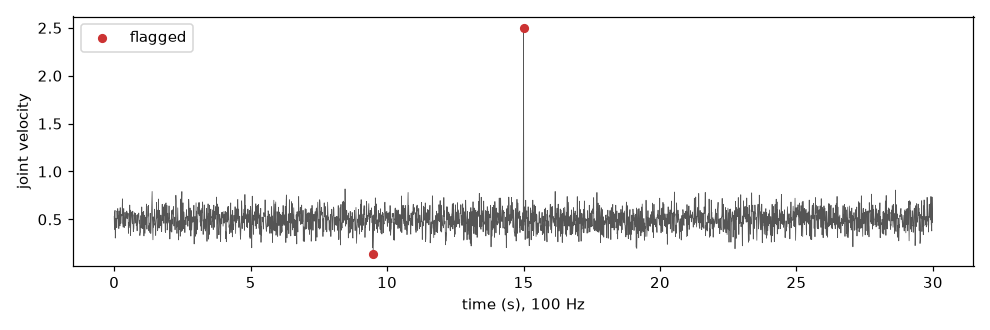
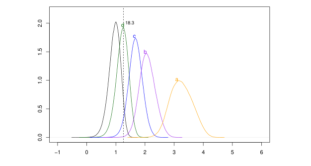

# Streaming anomaly detection

A robot joint sends its velocity 100 times a second. Most readings are ordinary noise; once in a
while one is absurd, because the arm bumped into something or a cable gave a false reading. The
controller must know *right now*, on that very sample, without waiting for the future. The tools
on this page give every new sample a score that says how unusual it is compared with the recent
past, and a yes/no flag when it is too unusual.



## 1. Flag a strange sample the moment it arrives

`StreamingDeviationDetector` takes one value per call and answers `True` when it deviates.

```python
import numpy as np
from dense_armor.utility.anomaly.streaming import StreamingDeviationDetector

rng = np.random.default_rng(42)
v = 0.5 + 0.1 * rng.standard_normal(3000)
v[1500] = 2.5
det = StreamingDeviationDetector(radius=30, ref_mult=3, n_sigmas=4.0)
flags = np.array([det.update(x) for x in v])
print(np.flatnonzero(flags))
```

```
[   4  949 1500]
```

The stream is 30 seconds of a joint velocity around 0.5 with noise 0.1, and one collision at
sample 1500 (value 2.5). The detector flags sample 1500. Sample 4 is the warm-up: with almost
nothing in memory every value looks new, so ignore the first few samples. Sample 949 is one
ordinary noise value that happened to fall far out: one false alarm in 3,000 samples with these
settings. Each call to `update` looks only at the past, so the answer is available on the same
sample, inside the control loop.

## 2. How "unusual" is measured

The detector compares the new value with the median of a window of past samples, in units of
the window's own spread.

```python
import numpy as np

w = np.array([10, 11, 9, 10, 12, 10, 11, 9, 10])
x = 30.0
med = np.median(w)
mad = np.median(np.abs(w - med))
s = 1.4826 * mad
print(med, mad, round(s, 4), round(abs(x - med) / s, 2))
```

```
10.0 1.0 1.4826 13.49
```

The score is

$$z = \frac{|x - \mathrm{med}(w)|}{S}, \qquad S = 1.4826 \cdot \mathrm{MAD}(w), \qquad \mathrm{MAD}(w) = \mathrm{med}\big(|w - \mathrm{med}(w)|\big),$$

where:

- $w$ is the window of past samples: `2 * radius * ref_mult` values before the new one;
- $\mathrm{med}(w)$ is its median, the "usual" value; unlike the mean, one absurd sample cannot
  drag it away;
- $\mathrm{MAD}(w)$ is the median distance of the samples from that median, a robust width;
- $1.4826$ turns the MAD into the standard deviation when the noise is normal (it is
  $1/\Phi^{-1}(3/4)$), so $z$ reads as "how many standard deviations away";
- the sample is flagged when $z$ is larger than `n_sigmas`.

In the example the past window is around 10 with MAD 1, so $S = 1.4826$ and the new value 30 is
13.49 standard deviations away: clearly flagged. This robust score is the Hampel identifier
(Pearson et al., 2016, "Generalized Hampel filters", *EURASIP J. Adv. Signal Process.*, eqs. 3 and 4).

## 3. The score itself, as a learn/score estimator

`StreamingDeviationScorer` gives the number instead of the flag, with the `learn_one` /
`score_one` interface used by online-learning pipelines.

```python
from dense_armor.utility.anomaly.deviation import StreamingDeviationScorer

sc = StreamingDeviationScorer(radius=5, ref_mult=2)
for v in [1.0, 1.2, 0.9, 1.1, 1.0, 0.8, 1.05]:
    sc.learn_one({"v": v})
print(round(sc.score_one({"v": 50.0}), 1), round(sc.score_one({"v": 1.1}), 2))
```

```
330.5 0.67
```

A reading of 50 scores 330.5 standard deviations; a reading of 1.1 scores 0.67, ordinary.
`score_one` never changes the estimator; `learn_one` adds the value to the window. A score above
`n_sigmas` is exactly a flag of `StreamingDeviationDetector`. It needs the streaming extra:
`pip install dense-armor[river]`.

## 4. The classic robust filters, one sample at a time

`dense_armor.utility.anomaly.filters` gives the four classic outlier rules as streaming scorers:
Hampel, Tukey fences, Chauvenet and sigma clipping.

```python
from dense_armor.utility.anomaly.filters import HampelScorer

s = HampelScorer(radius=15, n_sigmas=3.0)
for v in [1.0, 1.2, 0.9, 1.1, 1.0, 0.8, 1.05]:
    s.learn_one({"v": v})
print(s.is_outlier({"v": 50.0}), s.is_outlier({"v": 1.1}))
```

```
True False
```

Each scorer looks only at the `2 * radius` samples before the value being scored. The batch
versions on the [robust filters](robust_filters.md) page use a window centred on the value,
which looks at future samples; a live robot loop cannot, and that is the only difference.
Hampel is shown here; the other three rules are in the Details below.

Precision and recall on 5,000 seeded samples with 50 spikes of size 5–15 (1 % contamination),
window 30 (radius 15):

| Scorer | stationary noise (σ = 0.5): precision / recall | sine (amplitude 5, period 500) + same noise: precision / recall | µs per sample |
|---|---|---|---|
| Hampel | 0.459 / 1.000 | 0.318 / 1.000 | 90 |
| Tukey | 0.303 / 1.000 | 0.195 / 1.000 | 75 |
| Chauvenet | 0.282 / 0.980 | 0.167 / 1.000 | 28 |
| SigmaClip | 0.588 / 1.000 | 0.370 / 1.000 | 72 |

Every scorer catches the spikes; precision is the tuning knob. Two things lower it: a trend
inside the window (the sine moves about 1.9 units over 30 samples, and no scorer models a local
slope), and the short window, whose robust scale fluctuates from one window to the next, so a
3-sigma rule fires on some ordinary noise. To raise precision, increase `n_sigmas` or combine
the scores as [`pressure_valve`](robust_filters.md) does. At 100 Hz (10 ms per cycle) the cost
is under 1 % of the loop budget.

## 5. All the joints at once

A robot has several joints; `MultiChannelStreamingDeviationDetector` watches each one with its
own window.

```python
import numpy as np
from dense_armor.utility.anomaly.streaming import MultiChannelStreamingDeviationDetector

rng = np.random.default_rng(0)
qd = 0.1 * rng.standard_normal((500, 6))
qd[300, 2] = 3.0
det = MultiChannelStreamingDeviationDetector(n_channels=6, radius=30, ref_mult=3, n_sigmas=4.0)
flags = np.array([det.update(row) for row in qd])
print(flags[300], np.argwhere(flags[10:]).tolist())
```

```
[False False  True False False False] [[58, 5], [274, 4], [290, 2]]
```

Six joints, one fault on joint 2 at sample 300: row 300 flags only joint 2. After the warm-up
(the first 10 samples are skipped in the print) the list holds `[sample − 10, joint]`: `[290, 2]`
is the fault, and `[58, 5]`, `[274, 4]` are two noise values out of 2,940 checks. Each joint keeps
its own independent window; this is the same rule as step 1, without writing the loop over
joints by hand.

## 6. Two joints that must agree: online robust Mahalanobis

Some faults are visible only in the *combination* of channels: each joint alone looks normal,
but together they disagree. `OnlineRobustMahalanobis` learns how the channels usually move
together and scores how far a sample is from that pattern.

```python
import numpy as np
from dense_armor.utility.anomaly.mahalanobis import OnlineRobustMahalanobis

rng = np.random.default_rng(3)
a = rng.normal(0, 1, 500)
b = a + 0.1 * rng.normal(0, 1, 500)
m = OnlineRobustMahalanobis(feature_keys=["a", "b"])
for x, y in zip(a, b):
    m.learn_one({"a": float(x), "b": float(y)})
print(round(m.score_one({"a": 1.0, "b": 1.0}), 1), round(m.score_one({"a": 1.0, "b": -1.0}), 1))
```

```
1.4 16.4
```

Two joints that always move together (`b` follows `a`). The sample `(1, 1)` moves them together:
score 1.4, normal. The sample `(1, −1)` moves them in opposite directions: each value alone is
ordinary (one standard deviation), but the pair is unusual, score 16.4.

The score is the Mahalanobis distance

$$D(x) = \sqrt{\sum_{j=1}^{d} \frac{\langle x - \bar m,\; P_j\rangle^2}{\delta_j}},$$

where $\bar m$ is the robust centre (the geometric median, the point with the smallest total
distance to all samples), $P_j$ are the main directions in which the channels vary together and
$\delta_j$ how much they vary along each one (eigenvectors and eigenvalues of the *median
covariation matrix*, a robust version of the covariance). Both are updated at every sample by a
small step towards the new data:

$$m_{n+1} = m_n + \gamma_{n+1}\,\frac{X_{n+1} - m_n}{\lVert X_{n+1} - m_n\rVert}, \qquad \gamma_n = c_\gamma\,(n + n_0)^{-\gamma},$$

and the same for the covariation matrix with the outer product $(X - m)(X - m)^\top$. Dividing
by the distance means one absurd sample moves the estimate by at most $\gamma$, whatever its
size: that is what makes it robust. Source: Guillot, Godichon-Baggioni, Robin and Sansonnet
(arXiv:2601.03957), the online scheme of section 2.2.



*From Guillot et al. (arXiv:2601.03957), Figure 2: density of the (log10) Mahalanobis distance of
an outlier under four contamination scenarios (A–D); the dotted line is the inlier threshold. The
further a curve sits to the right of the line, the easier the outlier is to flag. Reproduced under
the paper's CC BY 4.0 licence.*

## API reference

::: dense_armor.utility.anomaly.streaming

::: dense_armor.utility.anomaly.deviation

::: dense_armor.utility.anomaly.filters

::: dense_armor.utility.anomaly.mahalanobis

## Details

- **The other three rules.** `TukeyScorer`: the normal range is
  $[Q_1 - 1.5\,\mathrm{IQR},\; Q_3 + 1.5\,\mathrm{IQR}]$ with $Q_1, Q_3$ the quartiles of the window
  and $\mathrm{IQR} = Q_3 - Q_1$ (window `[10, 11, 9, 10, 12, 10, 11, 9, 10]`: range
  $[8.5, 12.5]$). `ChauvenetScorer`: rejects when $N \cdot \mathrm{erfc}(z/\sqrt 2) < 0.5$; its
  `score_one` returns $N \cdot P$, so for Chauvenet a **low** score means anomalous.
  `SigmaClipScorer`: repeatedly removes values beyond `n_sigmas` standard deviations and scores
  against what remains. `HampelFilter` also replaces an outlier with the window median.
- **Window size.** A short window reacts faster but its median and MAD are noisier, so more
  ordinary samples are flagged (step 1 with `radius=5` flags dozens of noise samples; with
  `radius=30, n_sigmas=4.0` one in 3,000).
- **Online robust Mahalanobis, differences from the paper.** This module is the minimal version
  of Guillot et al.: it scores with the eigenvalues $\delta_j$ of the median covariation matrix
  and does not run the Robbins–Monro step that reconstructs the true variances $\lambda_j$, so
  the scale of the score is larger than the classical chi-squared one (threshold 7.0 by
  default). It also centres the outer product on the averaged median $\bar m$ and averages with
  weight $1/n$ (the paper uses $m_n$ and $1/(n+2)$).
- **Provenance.** `StreamingDeviationDetector` is the causal, zero-latency half of the
  [Arbiter](../protect/arbiter.md)'s per-point deviation check; the spike-versus-regime label
  needs to see the end of a run and stays batch-only. It was promoted from
  Dense-Evolution-Discovery after validation on two real physical domains (SO-101 robot arm,
  UCI HAR inertial data).
