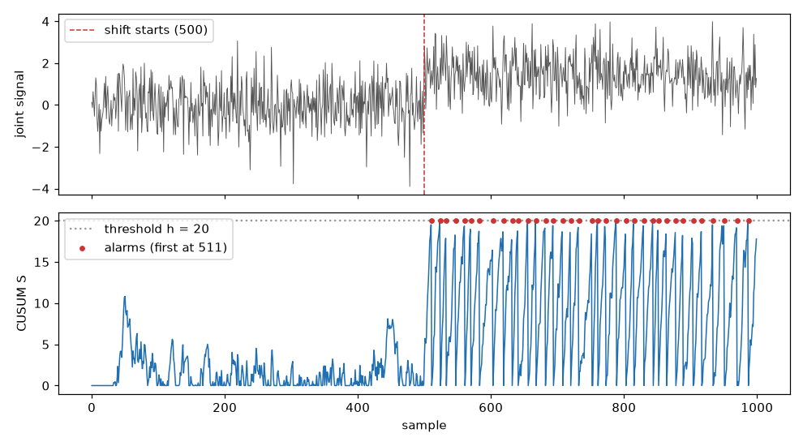

# CUSUM: catching a slow drift

A robot joint wears out a little every day. Each single reading still looks normal, so a
detector that judges one sample at a time never complains. Together, though, the readings have
moved. CUSUM ("cumulative sum") notices this: it keeps a running total of the small surprises,
like coins dropped one by one into a piggy bank, and raises an alarm when the bank is full.



## 1. Watch a stream, one sample at a time

`CUSUMDriftDetector` takes one value per call and tells you when the drift is real.

```python
import numpy as np
from dense_armor.drift.detector import CUSUMDriftDetector

rng = np.random.default_rng(0)
x = np.concatenate([rng.normal(0, 1, 500), rng.normal(1.5, 1, 500)])
det = CUSUMDriftDetector(reference="fixed")
print(next(i for i, v in enumerate(x) if det.update(v).drift_detected))
```

```
511
```

The first 500 samples are normal noise; from sample 500 the mean moves up by 1.5 standard
deviations, the kind of step a worn gear or a new payload produces. The detector raises its
first alarm at sample 511, eleven samples after the change. `update(v)` returns the detector
itself, and `drift_detected` is `True` only on the sample where the alarm fires. The detector
needs the streaming extra: `pip install dense-armor[river]`.

## 2. The piggy bank, as a formula

Every new sample adds its surprise and pays a small fee; the total never goes below zero.

```python
z = [0.2, -0.4, 0.1, 1.8, 2.1, 1.9, 2.3]
k, h, s = 0.5, 5.0, 0.0
for t, zt in enumerate(z, start=1):
    s = max(0.0, s + zt - k)
    print(t, round(s, 2), s > h)
```

```
1 0.0 False
2 0.0 False
3 0.0 False
4 1.3 False
5 2.9 False
6 4.3 False
7 6.1 True
```

The rule is

$$S_t = \max(0,\; S_{t-1} + z_t - k), \qquad \text{alarm when } S_t > h,$$

where:

- $z_t$ is how surprising sample $t$ is, in units of the normal noise (0 means "exactly as
  usual", 2 means "two noise-widths above usual");
- $k$ is the fee paid at every sample (the *slack*): small surprises are eaten by the fee and
  the total stays at zero, so ordinary noise never accumulates;
- $h$ is the size of the piggy bank (the *threshold*): when the total passes it, the alarm
  fires and the total starts again from zero;
- $S_t$ is the total after sample $t$.

In the run above the first three values are small, so the fee keeps the total at zero. From the
fourth value the readings sit about 2 above normal: each one adds roughly $2 - 0.5 = 1.5$, and
the total passes $h = 5$ at the seventh sample. A detector like this also watches the other
direction (readings that drop) with a second total, which is what "two-sided" means.

## 3. Where the surprise $z_t$ comes from

The detector measures each value against a window of the recent past, without looking at the
future. The centre of the window is its median and its width is
$S = 1.4826 \cdot \mathrm{MAD}$ (the median absolute distance from the median; the factor 1.4826
makes $S$ equal to the standard deviation when the noise is normal, see
[anomaly detection](../anomaly/streaming.md)). Then $z_t = (x_t - \text{median}) / S$.

Two ways to choose the window:

- `reference="fixed"`: the median and width are measured once, on the first
  `radius * ref_mult` samples, and kept. Best for a sustained step, like the run in step 1.
- `reference="adaptive"`: they are re-measured on a sliding window at every sample. The window
  follows a new level, so the detector reacts to the leading edge of a drift and then goes
  quiet.

## 4. How long will I wait? (before running anything)

The *average run length* (ARL) is the expected number of samples before an alarm.

```python
from dense_armor.drift.cusum import two_sided_arl

print(round(two_sided_arl(mu=0.0, k=0.5, h=5.0), 1))
print(round(two_sided_arl(mu=1.0, k=0.5, h=5.0), 1))
```

```
469.1
10.3
```

With $k = 0.5$ and $h = 5$: when nothing has changed ($\mu = 0$) a false alarm comes on average
every 469 samples; after a shift of one noise-width ($\mu = 1$) the real alarm comes after about
10 samples. These are the classic values of CUSUM tables, a useful sanity check.

The formula, for one side, with drift $\delta = \mu - k$ in noise units, is

$$\mathrm{ARL}(\delta) = \frac{e^{-2\delta h'} - 1 + 2\delta h'}{2\delta^2}, \qquad h' = h + 1.166,$$

and for $\delta = 0$ it becomes $h'^2$. This is equation (6) of Reynolds (1975), obtained by
treating the running total as a Brownian motion; the $+1.166$ is Siegmund's correction for the
last jump that overshoots the threshold. The two sides combine as
$1/\mathrm{ARL} = 1/\mathrm{ARL}^+ + 1/\mathrm{ARL}^-$.

## 5. The same estimate in your sensor's units

`detectability_report` turns the ARL into numbers for a real deployment: the noise level of your
signal and the size of the shift you care about.

```python
from dense_armor.drift.cusum import detectability_report

r = detectability_report(local_noise_scale=0.02, k=0.5, h=20.0, candidate_shift=0.04)
for key, val in r.items():
    print(key, val)
```

```
false_alarm_arl 1556958360.0943098
detection_arl 13.888444444444445
shift_in_sigma 2.0
```

A joint whose noise is 0.02 rad/s and a shift of 0.04 rad/s is a shift of 2 noise-widths. With
the default threshold $h = 20$ the alarm comes about 14 samples after it, and a false alarm is
expected only once in about 1.6 billion samples. The detector reports the same two numbers for its
own settings:

```python
from dense_armor.drift.detector import CUSUMDriftDetector

det = CUSUMDriftDetector(reference="fixed")
print(round(det.expected_detection_delay(1.0), 1))
print(round(det.expected_false_alarm_run(), 1))
```

```
40.3
1556958360.1
```

For a 1-sigma shift it predicts 40.3 samples; measured on a stream with `reference="fixed"`, the
delay is 41.

## 6. A whole recording at once

`cusum_detector` runs on a recorded series in one call and fires at exactly the same samples as
the streaming detector.

```python
import numpy as np
from dense_armor.drift.cusum import cusum_detector
from dense_armor.drift.detector import CUSUMDriftDetector

rng = np.random.default_rng(0)
x = np.concatenate([rng.normal(0, 1, 500), rng.normal(1.5, 1, 500)])
flags, s = cusum_detector(x, reference="fixed")
det = CUSUMDriftDetector(reference="fixed")
print(np.flatnonzero(flags)[:4], [i for i, v in enumerate(x) if det.update(v).drift_detected][:4])
```

```
[511 524 533 547] [511, 524, 533, 547]
```

Use the batch function to study a recording, and the streaming detector inside the control loop:
the alarms are the same.

## Results: CUSUM against two classic drift detectors

20 seeded streams of 1,000 N(0, 1) samples per row, mean shift at sample 500. Each cell is
recall (fraction of streams where the shift was found) / delay in samples / false alarms per
stream:

| shift (σ) | CUSUM adaptive | CUSUM fixed | Page–Hinkley | ADWIN |
|---|---|---|---|---|
| 0.5 | 0.00 / — / 0.00 | 0.55 / 96.0 / 0.10 | 1.00 / 81.0 / 0.05 | 1.00 / 127.8 / 0.00 |
| 1.0 | 0.00 / — / 0.00 | 0.90 / 42.3 / 0.50 | 1.00 / 41.2 / 0.10 | 1.00 / 54.2 / 0.00 |
| 1.5 | 0.15 / 15.0 / 0.05 | 1.00 / 20.9 / 0.40 | 1.00 / 42.9 / 0.10 | 1.00 / 43.0 / 0.00 |
| 2.0 | 0.05 / 6.0 / 0.00 | 1.00 / 12.6 / 0.35 | 1.00 / 14.9 / 0.05 | 1.00 / 41.4 / 0.00 |
| 3.0 | 0.85 / 9.8 / 0.00 | 1.00 / 7.8 / 0.05 | 1.00 / 11.2 / 0.05 | 1.00 / 11.0 / 0.00 |

"fixed" finds a sustained shift fastest from 1.5σ upward, at the price of more false alarms
than Page–Hinkley and ADWIN. "adaptive" is built for something else: its sliding reference
catches up with a new level, so it reacts to the leading edge of a drift and misses most small
step changes. ADWIN never raised a false alarm here but is the slowest on small shifts.

## API reference

::: dense_armor.drift.cusum

::: dense_armor.drift.detector

## Details

- **Real-world check of the ARL estimate.** `detectability_report` was validated on two real
  physical domains before being promoted from Dense-Evolution-Discovery. On real lidar (Sydney
  Urban Objects, 7 independent points) the real detection was always faster than the predicted
  mean ARL, a consistent bias in one direction. On a real accelerometer (UCI HAR, 5 points) the
  result was mixed: 2 points faster than predicted, 3 slower. The estimate assumes independent
  Gaussian noise; use it to reason before a benchmark, then measure the real rates.
- **Very quiet sensors.** When the local noise is extremely small the raw formula can predict a
  fractional ARL, which has no physical meaning; the docstring of `detectability_report` explains
  the floor applied.
- **Relation to the Arbiter.** The [Arbiter](../protect/arbiter.md) judges each point against an
  instantaneous threshold; CUSUM is its complement for slow, sustained changes.
- **Sources.** Reynolds, M. R. (1975), "Approximations to the Average Run Length in Cumulative Sum
  Control Charts", *Technometrics* 17(1), equation (6). Siegmund, D. (1985), *Sequential
  Analysis*, for the 1.166 boundary correction. Page, E. S. (1954), "Continuous inspection
  schemes", *Biometrika* 41, for the CUSUM rule.
