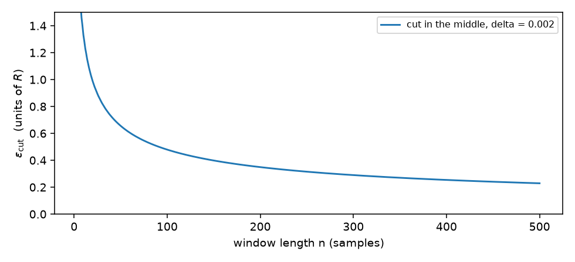
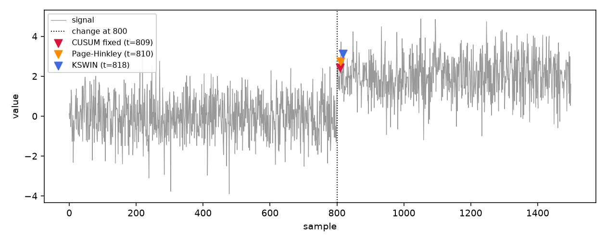

# Drift detectors

A robot that has been working fine for hours can start to behave differently
without failing outright: a joint gets warmer and its torque creeps up, a new
payload changes the load, a screw loosens and the vibration grows. The
controller still works, but the numbers it reads are no longer the numbers it
learned at the start. That is **drift**, and a robot that never notices it will
slowly lose accuracy.

The problem is as old as statistical quality control. Shewhart's control chart
(1931) watched a single sample against a fixed band and shouted as soon as one
of them fell outside it. It worked for large, sudden faults, but it was blind
to slow changes, because a small shift in the mean never makes a single sample
look unusual. Page (1954) proposed the answer that is still the basis of every
detector on this page: instead of judging each sample alone, **accumulate** the
small deviations over time, so that a shift too small to notice in one reading
still grows into a signal after enough of them.

A drift detector reads one number per sample and answers a single question:
*has the behaviour changed?* It must say so quickly, but it must not cry wolf:
a detector that fires on every small fluctuation is as useless as one that
stays silent. The four detectors on this page all use the same interface:
`det.update(x)` for one sample, and the flag `det.drift_detected` that becomes
`True` on the sample where the detector thinks something changed. Each one
trades delay for false alarms in a different way.

## 1. CUSUM with a fixed reference, even when the start is bad

The first detector, CUSUM, learns what "normal" looks like from the first
samples it sees, then adds up how far each new sample is from it. When the sum
grows past a threshold, it raises the flag. Missing readings at the start are
skipped and counted, so a sensor that fails to deliver its first samples does
not poison the reference.

*Origins.* Page, E. S. (1954), *Continuous inspection schemes*, Biometrika
41(1-2), 100-115. Page's idea was to keep a running sum of the distance between
each sample and a reference, and to reset the sum whenever it would go
negative. When the distributions before and after the change are known,
Page's CUSUM is asymptotically optimal as the false-alarm rate goes to zero
(Lorden 1971) and exactly optimal in Lorden's sense (Moustakides 1986), as
recalled by Xie et al. (2021); here the reference is estimated from the first
samples, so these results are a guide, not a guarantee.

```python
import numpy as np
from dense_armor.utility.drift.detector import CUSUMDriftDetector

rng = np.random.default_rng(0)
x = [float("nan")] * 10 + list(rng.normal(0, 1, 300)) + list(rng.normal(3, 1, 300))
det = CUSUMDriftDetector(reference="fixed", radius=5, ref_mult=4)
first = next(i for i, v in enumerate(x) if det.update(v).drift_detected)
print(first, det.n_missing)
```

```
315 10
```

The step starts at index 310 (10 NaN + 300 normal samples). The detector
raises its first alarm at 315, five samples after the step, and reports ten
skipped readings in `n_missing`.

The CUSUM statistic is built from the distance between each sample and a
reference, measured in robust standard deviations. If the sample sits close to
the reference, the distance is small; if it drifts away, the distance grows
and the accumulator climbs.

$$z_n = \frac{x_n - m}{s}, \qquad S_n = \max(0,\ S_{n-1} + z_n - k), \qquad \text{alarm when } S_n > h$$

Here $m$ and $s$ are the median and the robust scale of the first usable
window, $k$ is the slack (how far a sample must deviate before it starts
accumulating) and $h$ is the threshold on the sum. The defaults are $k = 0.5$
and $h = 20$.

The `max(0, ...)` is the reset: as long as a sample is close to the reference,
the accumulator falls back to zero and the detector forgets the small
fluctuations. Only a sustained deviation can push the sum high enough to
cross $h$.

## 2. Page-Hinkley: the same idea, units do not matter

The second detector, Page-Hinkley, compares each sample with the running mean,
measured in standard deviations. Because the comparison is in scale units,
the same settings work whether the stream is a torque in N·m or a tiny squared
error.

*Origins.* The name comes from Hinkley, D. V. (1971), *Inference about the
change-point from cumulative sum tests*, Biometrika 58(3), 509-523, who turned
Page's chart into an estimator of **when** the change happened. Dividing by
the running standard deviation is this library's choice, so that the settings
do not depend on the units of the stream.

```python
import numpy as np
from dense_armor.utility.drift.page_hinkley import PageHinkley

rng = np.random.default_rng(0)
x = list(rng.normal(0, 1, 500)) + list(rng.normal(3, 1, 500))
for scale in (1.0, 1e-4):
    det = PageHinkley(delta=0.05, threshold=20.0)
    print(scale, next(i for i, v in enumerate(x) if det.update(scale * v).drift_detected))
```

```
1.0 506
0.0001 506
```

The change starts at index 500. The detector fires at the same sample in both
runs, once with the signal as it is and once with the signal multiplied by
$10^{-4}$. The alarm index does not move, because the test uses standardized
units.

The statistic is Page's cumulative sum: the samples are compared with the
running mean, divided by the running standard deviation, and the accumulated
deviation from the slack $\delta$ is compared with its own running minimum.

$$W_n = S_n - \min_{0 \le j \le n} S_j, \qquad S_n = \sum_{i \le n} \Big(\frac{x_i - \bar x_i}{\sigma_i} - \delta\Big)$$

Xie et al. (2021) write the same construction as equation 2, with the
log-likelihood ratio in place of the standardized deviation.

Because both the reference mean and the reference scale move with the data,
Page-Hinkley keeps working even when "normal" itself slowly drifts over a long
recording. It is the same trade-off as CUSUM, with the reference sliding
instead of fixed.

## 3. ADWIN: a window that cuts itself

ADWIN keeps the recent samples in a window and, at each step, tries every
split of that window into an "older" and a "newer" part. If the two averages
differ by more than chance alone allows, it drops the older part and reports
a change.

*Origins.* Bifet, A., Gavaldà, R. (2007), *Learning from time-changing data
with adaptive windowing*, Proceedings of the 2007 SIAM International Conference
on Data Mining (SDM), 443-448. Bifet and Gavaldà were working on streaming
classifiers that had to forget old data at the right moment: a fixed window is
either too short (noisy) or too long (slow), and no single choice works for
every stream. Their idea was to let the window choose its own length, by
looking for a cut where the two halves disagree.

```python
import numpy as np
from dense_armor.utility.drift.adwin import ADWIN

rng = np.random.default_rng(0)
x = list(rng.normal(0, 1, 300)) + list(rng.normal(4, 1, 300))
det = ADWIN(delta=0.002, max_window=100)
first = next(i for i, v in enumerate(x) if det.update(v).drift_detected)
print(first, len(det._window))
```

```
339 40
```

The change starts at index 300. The detector fires at 339 and, after the cut,
keeps 40 samples in the window.

The threshold that decides whether the two averages are "too different" comes
from Hoeffding's inequality. For two sub-windows of sizes $n_0$ and $n_1$, with
values that lie in a range $R$, the probability that their sample averages
differ by more than $\varepsilon$ by chance is at most

$$P\big(|\hat\mu_0 - \hat\mu_1| \ge \varepsilon\big) \le 2\,e^{-2m\varepsilon^2/R^2}, \quad
m = \frac{n_0 n_1}{n_0 + n_1}, \qquad
\varepsilon_\text{cut} = R\sqrt{\frac{\ln(2n/\delta)}{2m}}$$

where $m$ is half the harmonic mean of the two sub-window sizes. Solving for
$\varepsilon$ at a total confidence level $\delta$, with a union bound over the
$n$ possible cuts, gives $\varepsilon_\text{cut}$. $R$ is measured online from
the range of the values currently in the window, so the detector does not
depend on the units of the stream.



This bound is cautious on short windows: $\varepsilon_\text{cut}$ grows as the
window gets shorter, because each side of the cut holds fewer samples and $m$
is small.
With 100 samples in the window, ADWIN needs a step of about 4 standard
deviations to fire; a 3σ step goes unnoticed.

## 4. KSWIN: compare the shapes, one alarm per change

KSWIN compares the newest 30 samples with 30 samples drawn at random from the
older part of the window, using the Kolmogorov–Smirnov test. The test measures
how far apart the two cumulative histograms are: a small distance means the
two groups look alike, a large distance means they do not. After an alarm, the
detector keeps only the newest samples, so a single change produces a single
alarm.

*Origins.* Raab, C., Heusinger, M., Schleif, F.-M. (2020), *Reactive soft
prototype computing for concept drift streams*, Neurocomputing 416, 340-351,
arXiv:2007.05432. The authors were working on learning systems that keep a set
of representative prototypes instead of a full model, and they needed to know
when the prototypes had become stale. The Kolmogorov–Smirnov test is a
classical two-sample test, free of distributional assumptions, so it fits a
stream where the shape can change and not only the mean.

```python
import numpy as np
from dense_armor.utility.drift.kswin import KSWIN

rng = np.random.default_rng(14)
x = list(rng.normal(0, 1, 400)) + list(rng.normal(2.5, 1, 400))
det = KSWIN(seed=0)
alarms = [i for i, v in enumerate(x) if det.update(v).drift_detected]
print(alarms)
```

```
[414]
```

The change starts at index 400, and the detector produces exactly one alarm,
at 414. The default parameters come from Raab et al. (2020): a window of 300
samples, a sample of 30, and a significance level $\alpha = 10^{-4}$.

The reset after an alarm is not in the paper. Without it, KSWIN would keep
firing on the same change for as long as the old and the new samples sit in
the window together; with it, the detector answers once and waits for the next
one.

## 5. The four side by side on a robot stream

The last test runs all four detectors on the CASPER dataset: a UR3e arm
sampled at 20 Hz, with a labelled change somewhere in the recording. The
signal used here is the squared shift residual of joint 5, averaged over 76 s
with a causal trailing mean; it is the same series the original CASPER
benchmark uses. The four detectors are run with their default settings,
untouched, through `evaluate_events`.

| detector | delay (s) | missed | false alarms / h |
|---|---|---|---|
| Page-Hinkley | 3.9 | 0 | 1041 |
| KSWIN | 7.8 | 0 | 217 |
| ADWIN | 12.2 | 0 | 540 |
| CUSUM (fixed reference) | 17.2 | 0 | 1188 |



The figure above is a synthetic illustration of the same behaviour on a clean
step: each marker is the first alarm of one detector, and the change is the
dotted line. ADWIN has no marker: on a 2σ step with a window of 100 samples its bound
is never crossed, as section 3 explains.

All four catch the change, none of them misses it. The false alarms are
counted over the whole recording. For the CUSUM they all come after the
labelled event — zero before the change — because a fixed reference keeps
firing while the level stays away from it. The CUSUM row matches the original
benchmark function `run_cusum` exactly: 17.2 s of delay, zero false alarms
before the change.

Faster is not automatically better. Page-Hinkley is the quickest to react, and
also the one that fires the most on normal data; KSWIN takes about twice as
long and produces five times fewer false alarms. CUSUM fixed is the slowest
here and produces the most false alarms per hour, because once the level has
moved, the fixed reference is permanently wrong and the detector keeps
re-arming on every fluctuation.

The right choice depends on the cost of a missed change against the cost of a
spurious alarm. For a robot, a false alarm may mean stopping the line for
inspection; a missed change may mean a worn joint that keeps degrading for
another shift. Both costs are real, and only the application knows which one
is worse.

## API reference

::: dense_armor.utility.drift.page_hinkley

::: dense_armor.utility.drift.adwin

::: dense_armor.utility.drift.kswin

::: dense_armor.utility.drift.detector

---

## Details

- CUSUM `reference="fixed"`: before this version a stream that started with
  missing or flat readings left the detector without a usable reference, and
  silent forever. Now non-finite samples do not count towards the reference span;
  the reference is retried on a sliding window of the last `span` finite
  values until its robust scale is usable, so a NaN or flat start no longer
  leaves the detector silent.
- ADWIN: the original paper (Bifet and Gavaldà 2007) is not on arXiv; the
  bound above is derived here from Hoeffding's inequality and a union bound
  over the cuts. Memory O(W) (the whole window is kept), each update O(W).
  The paper's original implementation uses an exponential histogram that
  brings both to O(log W); the O(W) version is a deliberate simplification
  for streams of a few hundred samples per window.
- KSWIN: the paper does not say what to do with the window after an alarm;
  keeping the newest `stat_size` samples gives one alarm per change.
- Benchmark: delays at 20 Hz; the table uses the trailing mean of e² over
  2T = 1520 samples (76 s), the series the original CASPER benchmark uses;
  joint 5. The synthetic figure in section 5 is generated by
  `docs/assets/drift/make_figure.py` from the library itself, on a clean
  Gaussian step for clarity.
- Sources:
  - Shewhart, W. A. (1931). *Economic Control of Quality of Manufactured
    Product*. Van Nostrand. The control chart.
  - Page, E. S. (1954). Continuous inspection schemes. *Biometrika*
    41(1-2), 100-115. The CUSUM.
  - Hinkley, D. V. (1971). Inference about the change-point from cumulative
    sum tests. *Biometrika* 58(3), 509-523. The Page-Hinkley form.
  - Lorden, G. (1971). Procedures for reacting to a change in distribution.
    *Annals of Mathematical Statistics* 42(6), 1897-1908. Asymptotic
    optimality of CUSUM.
  - Moustakides, G. V. (1986). Optimal stopping times for detecting changes
    in distributions. *Annals of Statistics* 14(4), 1379-1387. Exact
    optimality of CUSUM.
  - Bifet, A., Gavaldà, R. (2007). Learning from time-changing data with
    adaptive windowing. In *Proceedings of the 2007 SIAM International
    Conference on Data Mining*. ADWIN.
  - Lu, J., Liu, A., Dong, F., Gu, F., Gama, J., Zhang, G. (2018). Learning
    under concept drift: a review. arXiv:2004.05785. ADWIN and Page-Hinkley
    described in one place.
  - Raab, C., Heusinger, M., Schleif, F.-M. (2020). Reactive soft prototype
    computing for concept drift streams. *Neurocomputing* 416, 340-351,
    arXiv:2007.05432. KSWIN.
  - Xie, L., Zou, S., Xie, Y., Veeravalli, V. V. (2021). Sequential
    (quickest) change detection: classical results and new directions.
    arXiv:2104.04186. The general CUSUM/Page/Shewhart framework.
  - Kayan, H., et al. (2023). CASPER: a real-world dataset for anomaly
    detection in a robot arm. In *IEEE PerCom Workshops*. The robot
    benchmark.
