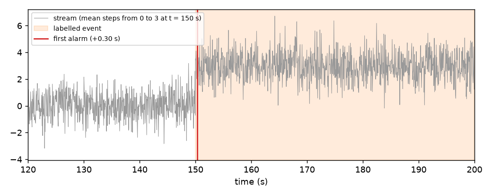
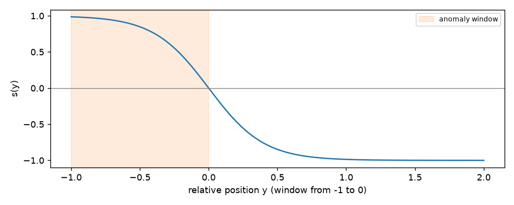

# Metrics and evaluation

## What this is

A robot that learns while it works needs a way to tell whether it is learning well. You cannot
stop it, collect a test set and score it at the end: the data never ends and the world changes
under it. The answer is to score it **as it goes**: every time a new sample arrives, compare
what the model predicted with what really happened, and keep a small running summary.

This page shows those running summaries (the **metrics**), the protocol that feeds them
(predict first, then learn), and the metrics made for events on a robot: how fast a fault is
caught and how often the alarm rings for nothing.



The figure is the case this page builds towards: a signal sampled at 20 Hz changes at
t = 150 s, a drift detector raises its first alarm 0.30 s later, and the metrics turn that into
numbers: delay, missed events, false alarms per hour.

## 1. A metric, one pair at a time

A metric reads one pair `(y_true, y_pred)` with `update` and answers `get()` at any moment.

```python
from dense_armor.utility.metrics import Accuracy

m = Accuracy()
for y, p in [(0, 0), (1, 1), (0, 1), (1, 1)]:
    m.update(y, p)
print(m.get(), m.n)
```

```
0.75 4
```

Three of the four predictions are right, so the accuracy is 3/4 = 0.75. The metric keeps two
running sums (hits and total), not the list of pairs, so its memory stays the same after a
million samples. Every metric on this page has the same members:

- `update(y_true, y_pred, t=None, w=1.0)` adds a pair, with an optional timestamp and weight;
- `revert(y_true, y_pred)` removes a pair added before (used by the rolling windows of step 6);
- `merge(other)` combines two metrics computed on different parts of the stream;
- `n` counts the pairs used, `n_missing` the pairs skipped because one side was `None` or `NaN`;
- `works_with(model)` tells whether the metric fits the model's role (classifier or regressor).

## 2. Classification: precision, recall, F1

When the model says "positive", how often is it right (**precision**)? Of the real positives,
how many did it find (**recall**)? **F1** is their harmonic mean.

```python
from dense_armor.utility.metrics import F1, Precision, Recall

y = [1, 0, 1, 1, 0, 1]
p = [1, 1, 1, 0, 0, 1]
ms = [Precision(positive=1), Recall(positive=1), F1(positive=1), F1(average="macro")]
for a, b in zip(y, p):
    for m in ms:
        m.update(a, b)
print([round(m.get(), 3) for m in ms])
```

```
[0.75, 0.75, 0.75, 0.625]
```

Count by hand for class 1: true positives TP = 3 (positions 0, 2, 5), one false positive FP
(position 1), one false negative FN (position 3).

$$P = \frac{TP}{TP + FP} = \frac{3}{4}, \qquad R = \frac{TP}{TP + FN} = \frac{3}{4}, \qquad
F_1 = \frac{2PR}{P + R} = 0.75.$$

`average="macro"` computes F1 for every class and takes the plain mean: class 0 has TP = 1,
FP = 1, FN = 1, so F1 = 0.5, and the macro F1 is (0.75 + 0.5) / 2 = 0.625. `"micro"` pools the
counts of all classes, `"weighted"` weights each class by how often it occurs; `FBeta(beta=2)`
weights recall more than precision.

## 3. Agreement beyond chance and probabilities

Accuracy can look good by chance when one class is common. **Cohen's kappa** subtracts the
agreement expected by chance.

```python
from dense_armor.utility.metrics import CohenKappa

m = CohenKappa()
for a, b in zip([1, 0, 1, 1, 0, 1], [1, 1, 1, 0, 0, 1]):
    m.update(a, b)
print(round(m.get(), 3))
```

```
0.25
```

$$\kappa = \frac{p_o - p_e}{1 - p_e}$$

where $p_o$ is the observed agreement (4 of 6) and $p_e$ the agreement two independent guessers
with the same label frequencies would reach: both say 1 four times out of six and 0 twice, so
$p_e = (4 \cdot 4 + 2 \cdot 2)/36 = 0.556$ and $\kappa = (0.667 - 0.556)/(1 - 0.556) = 0.25$.

When the model gives a probability instead of a label, score the probability itself.

```python
from dense_armor.utility.metrics import BrierScore, LogLoss

ll, br = LogLoss(), BrierScore()
for y, p in [(1, 0.9), (0, 0.2), (1, 0.6)]:
    ll.update(y, p)
    br.update(y, p)
print(round(ll.get(), 4), round(br.get(), 4))
```

```
0.2798 0.07
```

The **log-loss** is the mean of $-\ln p$ given to what happened: $-(\ln 0.9 + \ln 0.8 + \ln 0.6)/3
= 0.2798$. The **Brier score** is the mean squared distance between probability and outcome:
$(0.1^2 + 0.2^2 + 0.4^2)/3 = 0.07$. Both are lower for better forecasts.

## 4. Regression on a joint

A regressor predicts a number, for example the torque a joint needs at a given velocity. Here a
recursive least-squares model learns $\tau = 2\,\dot q$ from noisy samples, and three metrics
score it before each update.

```python
import numpy as np
from dense_armor.utility.learn.online_dynamics import RecursiveLeastSquares
from dense_armor.utility.metrics import MeanAbsoluteError, R2Score, RootMeanSquaredError

rng = np.random.default_rng(0)
rls, ms = RecursiveLeastSquares(), [MeanAbsoluteError(), RootMeanSquaredError(), R2Score()]
for qd in rng.normal(0, 1, 500):
    tau = 2.0 * qd + rng.normal(0, 0.1)
    for m in ms:
        m.update(tau, rls.predict_one({"qd": qd}))
    rls.learn_one({"qd": qd}, tau)
print([round(m.get(), 3) for m in ms])
```

```
[0.077, 0.098, 0.998]
```

The **MAE** is the mean of $|\tau - \hat\tau|$, the **RMSE** the square root of the mean of
$(\tau - \hat\tau)^2$, both in the units of the torque. They sit near the noise level: for noise
with standard deviation 0.1 the RMSE tends to 0.1 and the MAE to $0.1\sqrt{2/\pi} = 0.080$.
$R^2 = 1 - \sum(\tau - \hat\tau)^2 / \sum(\tau - \bar\tau)^2$ compares the model with always
predicting the mean: 0.998 means the model explains almost all the variation.

A robot arm has several joints. Pass the vector and the metric reports each joint and the mean.

```python
from dense_armor.utility.metrics import MeanAbsoluteError

m = MeanAbsoluteError()
m.update([1.0, 2.0], [1.5, 2.5])
m.update([2.0, 4.0], [2.5, 3.0])
print(m.get())
```

```
{'per_joint': [0.5, 0.75], 'mean': 0.625}
```

Joint 0 is off by 0.5 both times; joint 1 by 0.5 and then 1.0, mean 0.75.

## 5. Scoring the uncertainty

A prediction with an interval is useful only if the interval is honest. Two numbers check it:
how often the truth falls inside (**coverage**) and how wide the interval is (**width**).

```python
import numpy as np
from dense_armor.roles import AdaptiveConformalRegressor
from dense_armor.utility.learn.online_dynamics import RecursiveLeastSquares
from dense_armor.utility.metrics import IntervalCoverage, MeanIntervalWidth

rng = np.random.default_rng(0)
acr, cov, wid = AdaptiveConformalRegressor(RecursiveLeastSquares(), alpha=0.1), IntervalCoverage(), MeanIntervalWidth()
for qd in rng.normal(0, 1, 2000):
    x, tau = {"qd": qd}, 2.0 * qd + rng.normal(0, 0.1)
    cov.update(tau, acr.predict_interval(x))
    wid.update(tau, acr.predict_interval(x))
    acr.learn_one(x, tau)
print(round(cov.get(), 3), round(wid.get(), 3))
```

```
0.9 0.34
```

The interval was asked for 90 % coverage (`alpha=0.1`) and covers 90 % of the torques. Its mean
width 0.34 is close to the narrowest honest 90 % interval for Gaussian noise of standard
deviation 0.1, which is $2 \cdot 1.645 \cdot 0.1 = 0.33$.

When the prediction is a mean and a variance, the **Gaussian negative log-likelihood** scores both
at once.

```python
from dense_armor.roles import Estimate
from dense_armor.utility.metrics import GaussianNLL

m = GaussianNLL()
m.update(0.1, Estimate(mean=0.0, var=0.01))
print(round(m.get(), 4))
```

```
-0.8836
```

$$\mathrm{NLL} = \tfrac12 \ln(2\pi v) + \frac{(y - \mu)^2}{2v} = \tfrac12 \ln(0.0628) + \tfrac12
= -0.8836.$$

A variance that is too small makes the second term explode; one that is too large makes the
first term grow. The minimum is at the true spread.

## 6. Windows: only the recent past

A robot changes over time; the accuracy of last week says little about now. `Rolling` keeps a
metric over the last `window` samples, or the last `window_s` seconds.

```python
from dense_armor.utility.metrics import Accuracy, Rolling

m = Rolling(Accuracy(), window_s=0.05)
for i in range(20):
    m.update(1 if i < 17 else 0, 1, t=i * 0.01)
print(m.count, m.get())
```

```
5 0.4
```

At 100 Hz a window of 0.05 s holds 5 samples: the window keeps the samples with
$t_\text{now} - t < 0.05$. The last three predictions are wrong, so the accuracy over the
window is 2/5. The window uses the timestamps, not the sample count, so a dropped sample does
not stretch it. Any metric with `revert` can be rolled.

The **ROC-AUC** is the probability that a random positive gets a higher score than a random
negative. `RollingAUC` computes it exactly on the last `window` pairs.

```python
import numpy as np
from dense_armor.utility.metrics import RollingAUC

rng = np.random.default_rng(0)
m = RollingAUC(window=200)
for _ in range(1000):
    y = int(rng.random() < 0.3)
    m.update(y, y + rng.normal(0, 1.0))
print(round(m.get(), 3))
```

```
0.712
```

$$\mathrm{AUC} = \frac{1}{n_+ n_-}\sum_{i \in +}\sum_{j \in -}
\begin{cases} 1 & s_i > s_j \\ \tfrac12 & s_i = s_j \\ 0 & \text{otherwise} \end{cases}$$

Here positives score one unit higher than negatives with unit noise, so the long-run value is
$\Phi(1/\sqrt2) = 0.760$; a window of 200 pairs gives 0.712.

## 7. Predict, then learn

`progressive_val_score` runs the protocol for you: for each sample the model predicts, the
metric scores, then the model learns. Labels often arrive late (a technician confirms a fault at
the end of the shift); with `delay` the model learns each label only when it arrives.

```python
import numpy as np
from dense_armor.utility.evaluate import progressive_val_score
from dense_armor.utility.learn.online_classifiers import OnlineGaussianNB
from dense_armor.utility.metrics import Accuracy, Rolling

rng = np.random.default_rng(0)
qd = rng.normal(0, 1, 2000)
y = np.abs(qd) > np.where(np.arange(2000) < 1000, 0.5, 1.5)
s = [({"qd": a}, int(b)) for a, b in zip(qd, y)]
for d in (None, 300):
    m, tr = progressive_val_score(s, OnlineGaussianNB(), Rolling(Accuracy(), window=200), delay=d, every=200)
    print(d, [round(r, 2) for r in tr])
```

```
None [0.91, 0.94, 0.95, 0.95, 0.92, 0.54, 0.66, 0.76, 0.84, 0.84]
300 [0.0, 0.0, 0.0, 0.89, 0.95, 0.92, 0.71, 0.38, 0.59, 0.7]
```

The task is "is the joint moving fast?", and at sample 1000 the meaning of "fast" changes from
$|\dot q| > 0.5$ to $|\dot q| > 1.5$. With labels on time the rolling accuracy drops to 0.54 and
recovers to 0.84. With labels 300 samples late the drop comes later and goes deeper (0.38),
because the model keeps answering with the old rule until the new labels reach it. The first
three values are 0.0 because no label has arrived yet and nothing has been scored. `every=200`
returns the trace of the metric.

For metrics that need a probability, `progressive_val_proba_score` uses `predict_proba_one`.

```python
import numpy as np
from dense_armor.utility.evaluate import progressive_val_proba_score
from dense_armor.utility.learn.online_classifiers import OnlineGaussianNB
from dense_armor.utility.metrics import LogLoss

rng = np.random.default_rng(0)
s = [({"qd": v}, int(abs(v) > 0.5)) for v in rng.normal(0, 1, 2000)]
m, tr = progressive_val_proba_score(s, OnlineGaussianNB(), LogLoss(), every=500)
print([round(v, 3) for v in tr])
```

```
[0.312, 0.283, 0.264, 0.253]
```

The log-loss falls as the model sees more samples.

## 8. Choosing a model on the stream

`best_of` runs several models on the same stream with the same protocol and tells which one is
ahead.

```python
import numpy as np
from dense_armor.utility.evaluate import best_of
from dense_armor.utility.learn.online_classifiers import OnlineGaussianNB, OnlineSoftmaxRegression
from dense_armor.utility.metrics import Accuracy

rng = np.random.default_rng(0)
s = [({"qd": v}, int(abs(v) > 0.5)) for v in rng.normal(0, 1, 2000)]
sel = best_of([OnlineGaussianNB(), OnlineSoftmaxRegression()], Accuracy, stream=s)
print([round(v, 3) for v in sel.scores()], sel.current_best())
```

```
[0.941, 0.621] 0
```

"Fast in either direction" is not a straight cut on $\dot q$, so a linear softmax model cannot
learn it (0.621), while the Gaussian model, which learns a different spread per class, can
(0.941). `current_best()` returns the index 0 and `best_model()` the model itself. The second
argument is the metric class: each model gets its own fresh metric.

## 9. Events: delay and false alarms

A fault is not one sample: it lasts. `EventMetrics` takes the labelled event windows, then the
alarm times, and answers the two questions a robot operator asks: how late was the alarm, and
how often does it ring for nothing?

```python
from dense_armor.utility.metrics import EventMetrics

m = EventMetrics([(10.0, 20.0), (40.0, 45.0)], dt=0.5, normal_time_s=3600.0)
for t in (5.0, 12.0, 12.5, 30.0):
    m.add_alarm(t)
print(m.detection_delays_s(), m.missed_events(), m.false_alarms(), m.false_alarms_per_hour())
```

```
[2.0, None] 1 2 2.0
```

The first event starts at 10 s and the first alarm inside it is at 12 s: delay 2 s. The second
event has no alarm: missed. The alarms at 5 s and 30 s are outside every event: two false
alarms over one hour of normal operation, 2 per hour. `dt` is the sample period, used in step
10 to count the points of a window.

## 10. How much of the event was caught

Tatbul et al. (2018) extend precision and recall to ranges. The recall of one real event mixes
two rewards:

$$\mathrm{Recall}(R_i, P) = \alpha \cdot \mathrm{Existence}(R_i, P) + (1 - \alpha) \cdot
\mathrm{Overlap}(R_i, P) \qquad \text{(Eq. 4)}$$

The existence reward is 1 if any alarm falls inside the event (Eq. 5). The overlap reward
(Eq. 6) adds up a weight $\delta(i)$ for every point $i$ of the event that the alarms cover,
divided by the sum of all the weights, and is shrunk by a cardinality factor when the event is
split across several alarm ranges (Eq. 7). The weights are the **positional bias** of their
Figure 2b: flat ($\delta = 1$), front ($\delta = L - i + 1$, early points count more), back
($\delta = i$), middle. Precision (Eq. 9) uses the same overlap reward, with flat bias.

```python
from dense_armor.utility.metrics import EventMetrics

for bias in ("front", "back"):
    m = EventMetrics([(0.0, 9.0)], positional_bias=bias, threshold_window=1.0)
    for t in (0.0, 1.0, 2.0):
        m.add_alarm(t)
    print(bias, round(m.range_precision(), 3), round(m.range_recall(), 3), round(m.range_f1(), 3))
```

```
front 1.0 0.491 0.659
back 1.0 0.109 0.197
```

The event has 10 points (0 to 9 s at `dt=1.0`); the three alarms, merged into one range by
`threshold_window=1.0`, cover the first three. With front bias the weights are 10, 9, …, 1
(sum 55) and the covered ones add up to 10 + 9 + 8 = 27: recall 27/55 = 0.491. With back bias
they are 1 + 2 + 3 = 6: recall 6/55 = 0.109. Precision is 1.0 in both cases because every alarm
point lies inside the event. For a robot, front bias says "catching the start of a fault is what
matters".

## 11. One score for early detection: NAB

The Numenta Anomaly Benchmark (Lavin and Ahmad 2015) gives each detection a weight that depends
on where it falls.



$$s(y) = \frac{2}{1 + e^{5y}} - 1$$

where $y$ is the position relative to the window: $-1$ at its start, $0$ at its end, positive
after it. The earliest detection in a window earns $A_{TP}\,s(y)$; a missed window costs
$A_{FN}$; an alarm outside every window costs $|A_{FP}|\,s(y)$ measured after the preceding
window, or $-|A_{FP}|$ if no window precedes it. The total is normalised so that a perfect
detector scores 100 and a detector that never fires scores 0 (Eq. 4).

```python
from dense_armor.utility.metrics import EventMetrics

for alarms in ([0.0], [9.0], [9.0, 14.5], []):
    m = EventMetrics([(0.0, 10.0)])
    for t in alarms:
        m.add_alarm(t)
    print(alarms, round(m.nab_score(), 2))
```

```
[0.0] 100.0
[9.0] 62.67
[9.0, 14.5] 58.18
[] 0.0
```

A detection at 9 s in a window from 0 to 10 s has $y = -0.1$ and earns $s = 0.245$; normalised
between the null detector ($-1$) and the perfect one ($s(-1) = 0.987$) it gives
$100 \cdot 1.245 / 1.987 = 62.67$. The extra alarm at 14.5 s is 0.45 windows after the end:
$s = -0.809$, times $|A_{FP}| = 0.11$, which lowers the score to 58.18. The default weights are
the paper's standard profile ($A_{TP} = 1$, $A_{FP} = -0.11$, $A_{FN} = -1$); pass `a_tp`,
`a_fp`, `a_fn` to change them.

## 12. A real detector on a stream

`evaluate_events` runs a detector over `(t, x)` pairs and returns everything at once. This is
the case of the figure at the top.

```python
import numpy as np
from dense_armor.utility.drift.detector import CUSUMDriftDetector
from dense_armor.utility.evaluate import evaluate_events

rng = np.random.default_rng(1)
x = np.concatenate([rng.normal(0, 1, 3000), rng.normal(3, 1, 1000)])
det = CUSUMDriftDetector(reference="fixed", radius=76, ref_mult=10, k=0.5, h=20.0)
s = [(i / 20, v) for i, v in enumerate(x)]
r = evaluate_events(s, det, [(150.0, 199.95)], dt=0.05, normal_time_s=150.0)
print(round(r["detection_delays_s"][0], 2), r["missed"], r["false_alarms_per_hour"])
```

```
0.3 0 0.0
```

The CUSUM detector catches the step 0.30 s after it starts (6 samples at 20 Hz), misses
nothing and raises no alarm during the 150 s of normal operation. The returned dict also holds
`range_precision`, `range_recall`, `range_f1` and `nab_score`. A drift detector is read
through `update` and `drift_detected`; an anomaly detector through `score_one`, `learn_one` and
a `score_threshold` attribute.

## 13. A warning: point-adjusted F1

Many papers score anomaly detectors with **point adjustment**: if one point inside a real
anomaly is flagged, the whole anomaly counts as found. Kim et al. (2021) show that this rewards
noise.

```python
import numpy as np
from dense_armor.utility.metrics import F1, PointAdjustedF1

rng = np.random.default_rng(0)
y = np.zeros(2000, dtype=int)
for s in (200, 700, 1200, 1700):
    y[s:s + 100] = 1
p = (rng.random(2000) < 0.05).astype(int)
pa, f1 = PointAdjustedF1(positive=1, warn=False), F1(positive=1)
for a, b in zip(y.tolist(), p.tolist()):
    pa.update(a, b)
    f1.update(a, b)
print(round(pa.get(), 3), round(f1.get(), 3))
```

```
0.895 0.063
```

The "detector" flags 5 % of the samples at random. The plain F1 is 0.063, as it should be; the
point-adjusted F1 is 0.895, because each 100-sample anomaly almost surely contains one random
flag. `PointAdjustedF1` is here only to compare with published numbers; it warns when read.
Report the range-based metrics of step 10 next to it.

## API reference

::: dense_armor.utility.metrics

::: dense_armor.utility.evaluate

---

## Details

- **NAB, Eq. 1 against Figure 3.** The paper prints the scaled sigmoid as
  $\sigma^A(y) = (A_{TP} - A_{FP})\,\frac{1}{1 + e^{5y}} - 1$ and states that the right end of
  the window gives $\sigma(0) = 0$; that holds only when $A_{TP} - A_{FP} = 2$. Figure 3
  instead multiplies the scaled sigmoid by the profile weight (its total,
  $-1.0 \cdot 0.11 + 0.9999 \cdot 1 - 0.8093 \cdot 0.11 - 1.0 \cdot 0.11 = 0.6909$, checks out).
  The library follows Figure 3 and the text. The paper names two more profiles (reward low FP,
  reward low FN) without giving their weights, so only the standard weights are defaults.
- **Window boundary.** `Rolling(window_s=w)` drops a sample when $t_\text{now} - t \ge w$, with
  a tolerance of $10^{-9}$ s so that timestamps such as `i * 0.01` do not lose or gain a sample
  to rounding.
- **Same numbers as the robot benchmark.** On the CUSUM stream of step 12, `evaluate_events`
  returns the same delay and false alarms per hour as `run_cusum` in
  `benchmarks/casper_benchmark.py` for thresholds 2, 5 and 20 (tested).
- **Sources.** Tatbul, N. et al. (2018), "Precision and recall for time series", NeurIPS,
  arXiv:1803.03639. Lavin, A., Ahmad, S. (2015), "Evaluating real-time anomaly detection
  algorithms: the Numenta Anomaly Benchmark", IEEE ICMLA, arXiv:1510.03336. Kim, S. et al.
  (2021), "Towards a rigorous evaluation of time-series anomaly detection", arXiv:2109.05257.
  Ksieniewicz, P., Zyblewski, P. (2020), "stream-learn", arXiv:2001.11077 (test-then-train and
  prequential protocols). Amekoe, K. M. et al. (2024), arXiv:2409.10111 (delayed labels).
  Xie, L., Zou, S., Xie, Y., Veeravalli, V. V. (2021), "Sequential (quickest) change
  detection", arXiv:2104.04186 (detection delay and false alarm rate).
