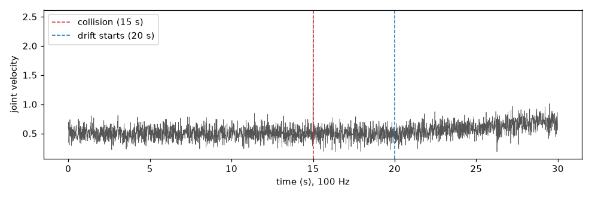

# Adaptive engine (Orca Stage 1)

A signal that drifts slowly is not a spike. It is a sequence of samples, each of them
plausible on its own, that together move the average. A purely local detector misses
this by construction: each sample is within the local window's amplitude, so nothing
fires. `Orca`'s Stage 1 is the module that handles this case: it does not judge each
sample against a fixed baseline, it continuously **re-estimates the baseline** and
damps toward it with a smooth curve.

The module is `AdaptiveSignalStabilizer`, a causal recursive filter written as a
`jax.lax.scan` so it can run inside a JAX pipeline without leaving the JIT.

## The signal

Two things happen to the same 100 Hz channel: a slow ramp from 0.5 to 0.7 rad/s starting
at sample 2000, and a spike at 1500. The spike is easy; the ramp is the one that catches
local detectors off guard.

```python
import numpy as np
rng = np.random.default_rng(42)
t = np.arange(3000) / 100
x = 0.5 + 0.1 * rng.standard_normal(3000)
x[1500] = 2.5
x[2000:] += 0.2 * (np.arange(1000) / 1000)
```

## 1. Filter the series

```python
import jax
jax.config.update("jax_enable_x64", True)
import jax.numpy as jnp
from dense_armor.core.engine import AdaptiveSignalStabilizer

stabilizer = AdaptiveSignalStabilizer()
clean = stabilizer.filter_data_stream(np.asarray(x))
```

`clean` is the same series with the spike removed and the ramp followed but slightly
smoothed — the filter does not fight a sustained change, it damps the transient part of
it.

## 2. What "adaptive" means here

The stabilizer keeps one internal state: an estimate `mu` of the current baseline. On
each sample:

1. It updates `mu` toward `x` with a rate `k` (the adaptation rate).
2. It computes the deviation `d = x − mu_before_update`.
3. It multiplies `d` by a **sigmoid damping factor** `σ(|d|)`, so small deviations pass
   through unchanged and large ones are compressed toward zero.
4. It adds the damped deviation back to `mu` to produce the cleaned value.

The sigmoid is why the filter is "smooth": there is no threshold at which the behaviour
switches from "pass" to "reject". A sample 0.05 away from the baseline is treated as
0.05 away; a sample 5 away is treated as much less than 5 away, but never as exactly
the baseline.

## 3. Presets

Four calibrated parameter sets ship with the library:

| preset | when to use |
|---|---|
| `balanced_v2` | default, good across signals |
| `cifar10_best_v1` | tuned for image-grid-like inputs |
| `pure_1d_time_v1` | reactive; follows fast changes more closely |
| `cifar10_hardened_lyapunov` | hardened; damps more aggressively |

```python
from dense_armor.core.preset import SIGNAL_STABILIZER_PRESETS
from dense_armor.core.engine import AdaptiveSignalStabilizer

stabilizer = AdaptiveSignalStabilizer(**SIGNAL_STABILIZER_PRESETS["balanced_v2"])
```

The presets are not just different numbers that happen to look distinct: on the same
noisy series with an outlier, `pure_1d_time_v1` leaves over **2×** the residual variance
of `balanced_v2` — it is a genuinely more reactive regime.

## 4. Where Orca uses it

`Orca.protect_and_forward` calls the stabilizer twice: once on the input tensor before
the model, once on the response after. The four-phase shield described on the
[Orca](orca.md) page is exactly this: purify, forward, purify, report trust scores.
Stage 2 (`Orca`'s Collatz-based gate) sits on top and decides how much of the damped
value to use versus how much of the raw value to trust on the input side; on the output
side the check is against the model's own response to the clean reference.

If you use `AdaptiveSignalStabilizer` on its own, you get the same soft damping without
the input/output distinction: a single cleaned stream.

## 5. Performance

The `jax.lax.scan` formulation means the filter compiles to a single fused loop, and
the per-sample cost after the first (compilation) call is on the order of a few
microseconds on CPU. On a 3000-sample series the whole call returns in well under a
millisecond of steady-state time; the first call is dominated by XLA compilation.

## API reference

::: dense_armor.core.engine

---

**See also**: [`Orca`](orca.md), which uses `AdaptiveSignalStabilizer` as Stage 1,
followed by a Collatz-based gate (Stage 2) deciding how much to damp toward the clean
reference. This is also the engine exercised directly by the adversarial test suite
(`test/test_boundA-E.py`) behind the
[robustness numbers on the home page](../index.md).
```
"""


"""## File 9/38 — `docs/anomaly/index.md`

```markdown
# Anomaly detection

An anomaly detector gives every sample a score: **high means the sample does not look
like the recent past**. A robot samples its joints 100 times a second; a detector has to
say, for each of those samples, whether it is a normal reading or something happened.

The detectors on these pages work one sample at a time: they see the sample, decide, and
forget nothing that came before. That is what makes them usable inside a control loop
that cannot wait for the future.

## The signal used in every example

One joint, sampled at 100 Hz, velocity around 0.5 rad/s. A collision at 15 s gives one
large spike; a worn gear makes the signal drift slowly from 20 s onward.



The spike is a single-sample jump; the drift is a slow change of the average. They need
different tools.

## Pages

- **[Streaming](streaming.md)** — score one sample at a time: robust deviation, the four
  classic filters (Hampel, Tukey, Chauvenet, sigma clipping) as causal scorers, and the
  online robust Mahalanobis distance for many channels together.
- **[Robust filters](robust_filters.md)** — the same four filters on a whole recorded
  series, and `pressure_valve`, which combines them.
- **[Curvature](curvature.md)** — a single bounded number in `[0, 1)` saying how far a
  value is from a reference, in the reference's own physical units.
