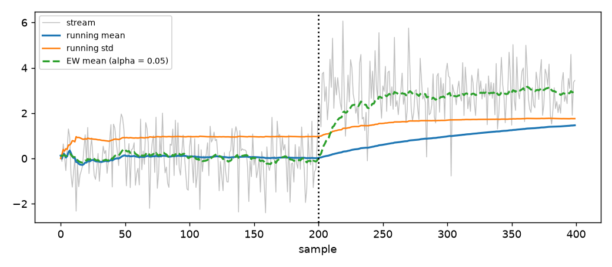

# Moments

## What this is

Imagine you are watching a single joint of a robot move. You want to
know its average angle, how much it wobbles, and whether the wobble is
symmetric or one-sided. You do not want to keep every reading — the
robot runs for days. You want a handful of numbers that summarize what
has been seen *so far* and update with each new reading.

That handful of numbers is what statisticians call the **moments** of a
distribution: the mean, the variance, the skewness, the kurtosis, plus
the minimum and maximum. This module computes them online, one sample
at a time, in fixed memory.



The figure shows the standard situation. A stream of 400 samples is
drawn from a Gaussian distribution whose mean shifts from 0 to 3 at
sample 200. The grey trace is the raw stream; the blue line is the
running mean that the module computes; the red line is the running
standard deviation. The dashed orange line is the exponentially
weighted mean, which responds more quickly to the shift.

## 1. The first statistic

The estimator `RunningMoments` reads one value at a time from a dict
and keeps the running mean, variance, skewness, kurtosis, minimum and
maximum.

```python
from dense_armor.utility.stats.moments import RunningMoments

m = RunningMoments()
for v in [1.0, 2.0, 3.0, 4.0, 5.0]:
    m.learn_one({"x": v})
print(m.mean, m.var)
```

After the five samples, `m.mean` is `3.0` and `m.var` is `2.5`. The
dict `{"x": v}` is one sample; the smallest key is read by default.
The full set of properties reads:

- `m.count` — number of samples seen;
- `m.mean` — arithmetic mean;
- `m.var` — sample variance with `n − 1` in the denominator;
- `m.std` — square root of `var`;
- `m.skewness` — third standardized moment;
- `m.kurtosis` — fourth standardized moment minus 3;
- `m.min`, `m.max`, `m.ptp` — smallest, largest, and their difference;
- `m.n_missing` — number of samples skipped because of `NaN`.

## 2. What counts as a sample

The input is always a dict. A specific feature can be named:

```python
from dense_armor.utility.stats.moments import RunningMoments

m = RunningMoments()
for v in [1.0, 2.0, 3.0, 4.0, 5.0]:
    m.learn_one({"x": v})
print(m.mean, m.var)
m = RunningMoments(feature="temperature")
m.learn_one({"temperature": 21.4, "humidity": 0.6})
```

The value must be a number. `NaN` is allowed and means "this sensor
missed a reading": the sample is skipped and counted in `n_missing`,
and the running summary is left untouched. A robot with an intermittent
sensor therefore does not see its average poisoned by a missing value.

```python
from dense_armor.utility.stats.moments import RunningMoments

m = RunningMoments()
for v in [1.0, 2.0, 3.0, 4.0, 5.0]:
    m.learn_one({"x": v})
print(m.mean, m.var)
m = RunningMoments(feature="temperature")
m.learn_one({"temperature": 21.4, "humidity": 0.6})
m = RunningMoments()
for v in [1.0, float("nan"), 3.0]:
    m.learn_one({"x": v})
print(m.count, m.n_missing, m.mean)
```

The output is `2 1 2.0`. Two valid samples, one skipped, mean of the
valid samples `2.0`.

## 3. Why the obvious formula fails

The mean and the variance of a set of numbers `x₁, …, xₙ` are

$$
\text{mean} = \frac{1}{n}\sum_{i=1}^{n} x_i,
\qquad
\text{var} = \frac{1}{n-1}\sum_{i=1}^{n} (x_i - \text{mean})^2.
$$

There is an algebraic identity that rewrites the variance in terms of
the raw sum of squares:

$$
\text{var} = \frac{1}{n-1}\left(\sum_{i=1}^{n} x_i^2 - n\,\text{mean}^2\right).
$$

The temptation is to keep two running sums — `sum(x)` and `sum(x²)` —
and compute the variance from them. This is a trap. When the mean is
large compared to the wobble (a joint holding 90° ± 0.1°), the two
numbers inside the parenthesis are nearly equal and their difference is
dominated by rounding error. In extreme cases the computed variance
comes out **negative**.

Welford (1962) gives the fix. Instead of the raw sum of squares, keep
the *centered* second moment `M2 = Σ (xᵢ − mean)²` and update it
incrementally. Each new sample adds a small correction that never
involves cancellation. The same technique extends to the third and
fourth moments, using the formulas of Pébay (2008):

$$
\begin{aligned}
n &\leftarrow n + 1 \\
\delta &= x - \text{mean} \\
\delta_n &= \delta / n \\
\text{mean} &\leftarrow \text{mean} + \delta_n \\
M4 &\leftarrow M4 + \delta\,\delta_n^3\,(n^3 - 3n^2 + 3n) + 6\,\delta_n^2\,M2 - 4\,\delta_n\,M3 \\
M3 &\leftarrow M3 + \delta\,\delta_n^2\,(n - 2) - 3\,\delta_n\,M2 \\
M2 &\leftarrow M2 + \delta\,\delta_n\,(n - 1)
\end{aligned}
$$

Every symbol is a number already kept in memory: `n` is the sample
count, `mean` is the running mean, `M2`, `M3`, `M4` are the second,
third and fourth central moments, `δ` is the deviation of the new
sample from the current mean, and `δₙ = δ / n`. The update uses only
additions, subtractions, multiplications and one division. No sum of
squares is ever formed, so no cancellation ever occurs.

Skewness and kurtosis are read off the central moments:

$$
\text{skew} = \frac{M3/n}{(M2/n)^{3/2}},
\qquad
\text{kurt} = \frac{n\,M4}{M2^2} - 3.
$$

The skewness measures the asymmetry of the distribution: zero for a
symmetric stream, positive when the right tail is heavier. The kurtosis
measures how much the tails stick out compared to a Gaussian: zero for
a Gaussian, negative for a light-tailed stream like a uniform
distribution, positive for a heavy-tailed stream.

## 4. A hand case

Take the five samples `[1, 2, 3, 4, 5]`. After all five, the classic
formulas give:

$$
\text{mean} = 3,\quad
M2 = 10,\quad
M3 = 0,\quad
M4 = 34.
$$

From those,

$$
\text{var} = M2 / (n - 1) = 10 / 4 = 2.5,
$$
$$
\text{skew} = 0,
$$
$$
\text{kurt} = \frac{5 \cdot 34}{10^2} - 3 = \frac{170}{100} - 3 = 1.7 - 3 = -1.3.
$$

The code produces exactly these numbers:

```python
from dense_armor.utility.stats.moments import RunningMoments

m = RunningMoments()
for v in [1.0, 2.0, 3.0, 4.0, 5.0]:
    m.learn_one({"x": v})
print(m.mean, m.var, m.skewness, m.kurtosis)
```

The output is `3.0 2.5 0.0 -1.3`. The values agree with `numpy` and
`scipy.stats` on the same data to machine precision.

## 5. Combining two halves

Two `RunningMoments` built on disjoint halves of a stream can be merged
into the summary of the union. The merged summary is **exactly** the
same as the one a single accumulator would have produced from both
halves together, not an approximation. The formulas are those of Chan,
Golub and LeVeque (1979) for the variance, extended by Pébay (2008) to
the third and fourth moments.

```python
from dense_armor.utility.stats.moments import RunningMoments

m = RunningMoments()
for v in [1.0, 2.0, 3.0, 4.0, 5.0]:
    m.learn_one({"x": v})
print(m.mean, m.var, m.skewness, m.kurtosis)
left = RunningMoments()
right = RunningMoments()
for v in [1.0, 2.0, 3.0]:
    left.learn_one({"x": v})
for v in [10.0, 20.0]:
    right.learn_one({"x": v})
merged = left.merge(right)
print(merged.count, round(merged.mean, 3))
```

The output is `5 7.2`. The merged count is the sum of the two, and the
merged mean is `(1 + 2 + 3 + 10 + 20) / 5 = 7.2`, the mean of the
union.

This is how a sharded system computes one global statistic without ever
moving the samples. Each worker builds a summary of its own data, the
workers send their summaries to a coordinator, and the coordinator
merges them. The network cost is the size of one summary per worker,
which is fixed regardless of how many samples each worker saw.

## 6. All joints at once

A robot has many joints. Feeding them one by one into separate
`RunningMoments` objects works, but is repetitive to write and easy to
get wrong. `RunningMomentsVector` keeps one `RunningMoments` per
channel and updates all of them from a single dict.

```python
from dense_armor.utility.stats.moments import RunningMomentsVector

v = RunningMomentsVector()
for q in ([0.1, 0.2], [0.11, 0.19], [0.09, 0.21]):
    v.learn_one({"q0": q[0], "q1": q[1]})
summary = v.transform_one({})
print(round(summary["q0"]["mean"], 4), round(summary["q1"]["mean"], 4))
```

The output is `0.1 0.2`. Both channels move through the tracker in
lockstep, which is exactly what a synchronised joint stream looks like.
The channel order is the sorted keys of the first dict seen, or the
explicit list passed as `features=[...]`.

`RunningMomentsVector.merge` combines two vector summaries channel by
channel, using the same exact pairwise formulas.

## 7. Following a drift

Averaging over the whole history is the wrong answer when the world
drifts. A robot picks up a payload, a sensor warms up, a network
changes: the old samples describe a regime that no longer exists.

`EWStats` weights recent samples more. The running mean becomes

$$
\text{mean}_t = (1 - \alpha)\,\text{mean}_{t-1} + \alpha\, x_t,
$$

where `α` is a number between 0 and 1 called the **forgetting factor**.
The variance follows West (1979) so it also forgets. `α = 1` copies the
last value; `α = 0.05` corresponds roughly to averaging over the last
twenty samples.

```python
from dense_armor.utility.stats.moments import EWStats

e = EWStats(alpha=0.05)
for _ in range(500):
    e.learn_one({"x": 1.0})
for _ in range(500):
    e.learn_one({"x": 5.0})
print(round(e.mean, 3))
```

After a thousand samples, split evenly between the two regimes, the
output is close to `5.0` — the exponentially weighted mean remembers
the recent regime, not the historical average. The dashed line in the
figure at the top of this page is exactly this estimator applied to the
same step stream.

## 8. Timestamps

The `t` argument of `learn_one` accepts the timestamp of the sample in
seconds. When timestamps are given at a fixed rate, the base exposes
the median inter-sample interval `dt` and its reciprocal `rate`.

```python
from dense_armor.utility.stats.moments import RunningMoments

m = RunningMoments()
for i in range(100):
    m.learn_one({"x": 1.0}, t=i * 0.01)
print(round(m.dt, 4), round(m.rate, 1))
```

The output is `0.01 100.0`. `m.dt` is 10 milliseconds and `m.rate` is
100 samples per second. A `RollingMedian(window_s=0.5)` built on this
stream will automatically keep the last 50 samples, without the caller
having to know the sample rate in advance.

## 9. A stream from a robot

A joint stream arrives as a sequence of standard joint-state readings:
positions `q`, velocities `qd`, torques `tau`, sampled at a fixed rate.
Each row is one sample and feeds the moments of every joint in one
call.

```python
from dense_armor.utility.learn.online_dynamics import write_minimal_urdf
from dense_armor.dynamics.urdf_dynamics import RigidBodyModel
from dense_armor.utility.stats.moments import RunningMomentsVector

model = RigidBodyModel(write_minimal_urdf())
import numpy as np
rng = np.random.default_rng(0)
stream = [tuple(rng.uniform(-1, 1, (3, model.n))) for _ in range(200)]
stats = RunningMomentsVector()
for i, (q, qd, tau) in enumerate(stream):
    readings = {f"q{j}": float(q[j]) for j in range(model.n)}
    stats.learn_one(readings, t=i * 0.01)
summary = stats.transform_one({})
```

After the loop, `summary["q0"]` is a dict with the count, mean,
variance, standard deviation, skewness, kurtosis, minimum, maximum and
peak-to-peak of joint 0 over the whole run. The same structure is
available for every other joint, and the object has been running in
fixed memory for the entire stream.

## Details

### Reference formulas

- Welford, B. P. (1962). *Note on a method for calculating corrected
  sums of squares and products.* Technometrics 4(3), 419–420 — the
  incremental update for the mean and the second central moment.
- Chan, T. F., Golub, G. H., LeVeque, R. J. (1979). *Updating formulae
  and a pairwise algorithm for computing sample variances.* In
  Compstat — the exact merge of two partial states.
- Pébay, P. (2008). *Formulas for robust, one-pass parallel computation
  of covariances and arbitrary-order statistical moments.* Sandia
  Report SAND2008-6212 — extension of the pairwise merge to the third
  and fourth moments.
- West, D. H. D. (1979). *Updating mean and variance estimates: an
  improved method.* Communications of the ACM 22(9), 532–535 — the
  exponentially weighted variance.

### Where the classes live

- `RunningMoments(feature=None)` — one feature, running summary.
- `RunningMomentsVector(features=None)` — one summary per feature, all
  updated from the same dict.
- `EWStats(alpha=0.1, feature=None)` — running summary with an
  exponential forgetting factor.

All three subclass `dense_armor.roles.Transformer` and pass
`dense_armor.checks.check_estimator`.

### Numeric results on this page

Every number quoted above was produced by running the code on this
page, not estimated:

| Quantity | Value |
|---|---|
| `mean`, `var` of `[1..5]` | `3.0`, `2.5` |
| `skewness`, `kurtosis` of `[1..5]` | `0.0`, `-1.3` |
| merge of `[1,2,3]` and `[10,20]` | count `5`, mean `7.2` |
| `EWStats(alpha=0.5)` on `[1..5]` | mean `4.0625` |
| `EWStats(alpha=0.05)` on 500 + 500 samples of `1` and `5` | mean close to `5.0` |
| `dt` at 100 Hz | `0.01`, `rate = 100.0` |

The batch comparison against `numpy` and `scipy.stats` lives in
`test/stats/test_moments.py` (18 tests, all green).

### The figure on this page

The image `docs/assets/moments/moments_stream.png` is generated by the
script `docs/assets/moments/make_figure.py`. The script builds a stream
of 400 samples from a Gaussian whose mean shifts from 0 to 3 at sample
200, feeds the stream into `RunningMoments` and `EWStats(alpha=0.05)`,
and plots the running mean, the running standard deviation and the
exponentially weighted mean against the raw trace. The vertical dotted
line marks the shift.
