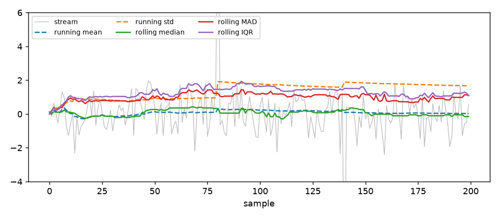

# Robust statistics

## What this is

A robot has a temperature sensor on its shoulder. The sensor is
usually accurate, but once every few minutes it glitches and reports a
value fifty degrees higher than the real one. If you compute the mean
of the last hundred readings, the glitch pulls the average up by half a
degree, and it takes another hundred clean readings before the mean
returns to where it was.

The mean is not robust: a single bad sample can move it as much as it
wants. The median is: a single bad sample cannot move it at all, as
long as fewer than half of the samples are bad.

This module computes the **robust** statistics of a stream — median,
median absolute deviation, interquartile range, arbitrary quantile —
over a bounded window. A window is a small number of the most recent
samples. Memory stays fixed, cost per sample stays fixed, and the
statistic is not affected by isolated outliers.



The figure shows a short stream of two hundred Gaussian samples with
two large spikes injected at samples 80 and 140. The running mean
jumps at each spike and takes many samples to recover. The rolling
median, the rolling MAD and the rolling IQR do not move.

## 1. The first estimator

`RollingMedian` keeps the last `window` samples in a small queue and
answers with their median.

```python
from dense_armor.utility.stats.robust import RollingMedian

m = RollingMedian(window=5)
for v in [3.0, 1.0, 4.0, 1.0, 5.0, 9.0, 2.0]:
    m.learn_one({"x": v})
print(m.value)
```

The output is `4.0`. After the seven samples, the window holds the five
most recent values `[1.0, 5.0, 9.0, 2.0, ...]` — actually the last five
of the input, which are `[4.0, 1.0, 5.0, 9.0, 2.0]`. Sorted, those are
`[1.0, 2.0, 4.0, 5.0, 9.0]`, and their median is `4.0`.

The dict `{"x": v}` is one sample. The smallest key is read by default;
`RollingMedian(feature="temperature")` names a specific one.

## 2. What a window is

The window is a FIFO queue of fixed length. When a new sample arrives
and the queue is full, the oldest sample is dropped and the new one is
added.

```python
from dense_armor.utility.stats.robust import RollingMedian

m = RollingMedian(window=5)
for v in [3.0, 1.0, 4.0, 1.0, 5.0, 9.0, 2.0]:
    m.learn_one({"x": v})
print(m.value)
m = RollingMedian(window=3)
for v in [10.0, 20.0, 30.0, 1.0]:
    m.learn_one({"x": v})
print(m.value)
```

The output is `20.0`. The window went from `[10, 20, 30]` to
`[20, 30, 1]`; sorted, `[1, 20, 30]`; median `20.0`.

The window can also be given in **seconds**, using the timestamps:

```python
from dense_armor.utility.stats.robust import RollingMedian

m = RollingMedian(window=5)
for v in [3.0, 1.0, 4.0, 1.0, 5.0, 9.0, 2.0]:
    m.learn_one({"x": v})
print(m.value)
m = RollingMedian(window=3)
for v in [10.0, 20.0, 30.0, 1.0]:
    m.learn_one({"x": v})
print(m.value)
m = RollingMedian(window_s=0.05)
for i in range(100):
    m.learn_one({"x": float(i)}, t=i * 0.01)
print(m.window_size)
```

The output is `5`. At 100 Hz (one sample every 0.01 seconds), half a
second contains five samples. The base keeps the median inter-sample
interval `dt` and converts a window in seconds to a number of samples
automatically. Before two timestamps have been seen, `dt` is `None` and
the window falls back to whatever `window` was set to.

## 3. Why the median is robust

Take a stream of numbers. The **mean** is the sum divided by the count.
The **median** is the value that sits in the middle when the samples
are sorted: half are smaller, half are larger. For an odd count, the
median is one of the samples; for an even count, it is halfway between
the two central ones.

The formulas, for a sample `x₁ ≤ x₂ ≤ … ≤ xₙ` sorted:

$$
\text{median} =
\begin{cases}
x_{(n+1)/2} & n \text{ odd}, \\[4pt]
\tfrac{1}{2}\left(x_{n/2} + x_{n/2+1}\right) & n \text{ even}.
\end{cases}
$$

The median is robust because a single large value only changes which
rank it occupies: it moves to one end of the sorted list and the middle
does not move.

The price of robustness is that the median ignores information. If you
have `[1, 2, 3, 4, 1000]`, the mean is `202` and the median is `3`. The
median says "the typical value is 3", which is true; the mean is
dragged by the outlier.

## 4. Measuring the wobble: MAD

Once you have the median, you need a scale — a number that says how
much the stream wobbles around the median. The natural robust choice is
the **median absolute deviation**:

$$
\text{MAD} = \operatorname{median}\!\left(\left|x_i - \operatorname{median}(x)\right|\right).
$$

In words: compute the deviation of every sample from the median, take
the absolute value of each, and take the median of those absolute
deviations. The result is a scale in the same units as the data.

For Gaussian data, the MAD is about `0.6745 σ`, not `σ`. To make the
MAD comparable to the standard deviation of a Gaussian, multiply by the
constant

$$
1 / 0.6745 \approx 1.4826.
$$

This is the value of `MAD_SCALE` in the module, and it is what
`RollingMAD.value` returns by default. The constant was popularised by
Hampel (1974). If you want the raw MAD without the scaling, pass
`scale=1.0`:

```python
from dense_armor.utility.stats.robust import RollingMAD

m = RollingMAD(window=5, scale=1.0)
for v in [1.0, 2.0, 3.0, 4.0, 5.0]:
    m.learn_one({"x": v})
print(m.value)
```

The output is `1.0`, the raw MAD.

## 5. A hand case: MAD on five samples

Take `[1, 2, 3, 4, 5]`. The median is `3`. The deviations from the
median are `|1−3|=2`, `|2−3|=1`, `|3−3|=0`, `|4−3|=1`, `|5−3|=2`.
Sorted: `[0, 1, 1, 2, 2]`. The median of those is `1`. The default
`RollingMAD` multiplies by `1.4826`:

```python
from dense_armor.utility.stats.robust import RollingMAD

m = RollingMAD(window=5)
for v in [1.0, 2.0, 3.0, 4.0, 5.0]:
    m.learn_one({"x": v})
print(round(m.value, 4))
```

The output is `1.4826`. The raw MAD is `1`; the scaled MAD is
`1.4826`. Both are useful: the raw one for the "middle spread of the
middle 50%", the scaled one for comparing to a Gaussian standard
deviation.

## 6. Measuring the spread: IQR

Another robust scale is the **interquartile range**, the difference
between the 75th and the 25th percentile:

$$
\text{IQR} = Q_{0.75} - Q_{0.25}.
$$

For Gaussian data, the IQR is about `1.349 σ`, so dividing by that
constant gives a scale comparable to `σ`. The module provides the raw
IQR by default and the sigma-equivalent scale on request:

```python
from dense_armor.utility.stats.robust import IQR_SCALE, RollingIQR

m = RollingIQR(window=5, scale=IQR_SCALE)
for v in [1.0, 2.0, 3.0, 4.0, 5.0]:
    m.learn_one({"x": v})
print(round(m.value, 4))
```

The output is `2.0`. The raw IQR of `[1..5]` is `Q3 − Q1 = 4 − 2 = 2`.
Multiplying by `IQR_SCALE = 1 / 1.349 ≈ 0.7413` would give `1.4826`,
the same as the scaled MAD — which is exactly what you would expect
for a Gaussian sample.

### Which one to use

- **MAD** — easier to defend as a scale ("how much do the deviations
  from the median wobble?"). Its Gaussian scale factor is `1.4826`.
- **IQR** — easier to explain as a spread ("how wide is the middle half
  of the data?"). Its Gaussian scale factor is `1 / 1.349 ≈ 0.7413`.

Both are robust to outliers. The MAD is slightly more sensitive to the
tails; the IQR slightly less.

## 7. Any quantile, not just the median

The 50th percentile is the median. The 90th percentile is what a
service-level agreement usually refers to ("99% of requests under
200 ms"). `RollingQuantile` gives any `q` between 0 and 1, using the
same linear interpolation as `numpy.percentile`.

```python
from dense_armor.utility.stats.robust import RollingQuantile

m = RollingQuantile(q=0.9, window=5)
for v in [1.0, 2.0, 3.0, 4.0, 5.0]:
    m.learn_one({"x": v})
print(m.value)
```

The output is `4.6`. The sorted window is `[1, 2, 3, 4, 5]`. The
position for `q = 0.9` over 5 samples is `0.9 × (5 − 1) = 3.6`. The
integer part is 3, the fractional part is 0.6. The value is
`x[3] + 0.6 · (x[4] − x[3]) = 4 + 0.6 = 4.6`.

For `q = 0.5`, `RollingQuantile` returns exactly the same value as
`RollingMedian`. The two are interchangeable at `q = 0.5`.

## 8. All joints at once

A robot has many joints. `RollingMedianVector` keeps one rolling median
per channel and updates all of them from a single dict.

```python
from dense_armor.utility.stats.robust import RollingMedianVector

v = RollingMedianVector(window=3)
for q in ([0.1, 0.2], [0.12, 0.18], [0.11, 0.21], [0.09, 0.19]):
    v.learn_one({"q0": q[0], "q1": q[1]})
summary = v.transform_one({})
print(round(summary["q0"]["value"], 4), round(summary["q1"]["value"], 4))
```

The output is `0.11 0.19`. Each channel keeps its own window of three
samples, so the median of joint 0 is the median of the last three `q0`
values, and similarly for joint 1.

## 9. A stream from a robot

A joint stream arrives as a sequence of standard joint-state readings:
positions `q`, velocities `qd`, torques `tau`. Rolling medians are the
right filter when the stream contains occasional spikes that must be
ignored but not removed.

```python
from dense_armor.utility.learn.online_dynamics import write_minimal_urdf
from dense_armor.dynamics.urdf_dynamics import RigidBodyModel
from dense_armor.utility.stats.robust import RollingMedianVector

model = RigidBodyModel(write_minimal_urdf())
import numpy as np
rng = np.random.default_rng(0)
stream = [tuple(rng.uniform(-1, 1, (3, model.n))) for _ in range(200)]
filtered = RollingMedianVector(window=5)
for i, (q, qd, tau) in enumerate(stream):
    readings = {f"q{j}": float(q[j]) for j in range(model.n)}
    filtered.learn_one(readings, t=i * 0.01)
summary = filtered.transform_one({})
```

After the loop, `summary["q0"]["value"]` is the median of the last five
positions of joint 0. A spike in `q0` at the end of the stream does not
move the answer, as long as the spike is shorter than half the window.

The window is five samples by default; for a control loop at 1 kHz that
is 5 milliseconds. Passing `window_s=0.05` would use the timestamps to
choose 50 samples instead.

## 10. Peak-to-peak, minimum and maximum

Every rolling robust statistic also carries the number of samples seen
and the number of `NaN` samples skipped:

```python
from dense_armor.utility.stats.robust import RollingMedian

m = RollingMedian(window=5)
for v in [3.0, 1.0, 4.0, 1.0, 5.0, 9.0, 2.0]:
    m.learn_one({"x": v})
print(m.value)
m = RollingMedian(window=3)
for v in [10.0, 20.0, 30.0, 1.0]:
    m.learn_one({"x": v})
print(m.value)
m = RollingMedian(window_s=0.05)
for i in range(100):
    m.learn_one({"x": float(i)}, t=i * 0.01)
print(m.window_size)
m = RollingMedian(window=5)
for v in [1.0, float("nan"), 3.0, float("nan"), 5.0]:
    m.learn_one({"x": v})
print(m.count, m.n_missing, m.value)
```

The output is `3 2 3.0`. Three valid samples, two skipped, and the
median of the valid ones. A sensor glitch does not corrupt the window;
it bumps a counter.

## Details

### Reference formulas

- Tukey, J. W. (1977). *Exploratory Data Analysis.* Addison-Wesley —
  the interquartile range and the median-based view of robustness.
- Hampel, F. R. (1974). *The influence curve and its role in robust
  estimation.* Journal of the American Statistical Association 69(346),
  383–393 — the median absolute deviation and the `1.4826` scale
  constant.
- Hyndman, R. J., Fan, Y. (1996). *Sample quantiles in statistical
  packages.* The American Statistician 50(4), 361–365 — the type 7
  quantile interpolation used by `numpy.percentile` and by this module.

### Where the classes live

- `RollingMedian(window=20, window_s=None, feature=None)` — median of
  the last window.
- `RollingMAD(window=20, window_s=None, feature=None, scale=1.4826)` —
  scaled median absolute deviation.
- `RollingIQR(window=20, window_s=None, feature=None, scale=1.0)` —
  interquartile range, with an optional sigma-equivalent scale.
- `RollingQuantile(q=0.5, window=20, window_s=None, feature=None)` —
  arbitrary quantile.
- `RollingMedianVector(window=20, window_s=None, features=None)` — one
  rolling median per feature.

All five subclass `dense_armor.roles.Transformer` and pass
`dense_armor.checks.check_estimator`.

### Numeric results on this page

Every number quoted above was produced by running the code on this
page.

| Quantity | Value |
|---|---|
| median of the last 5 of `[3,1,4,1,5,9,2]` | `4.0` |
| median of the last 3 of `[10,20,30,1]` | `20.0` |
| `window_s=0.05` at 100 Hz | `5` samples |
| raw MAD of `[1..5]` | `1.0` |
| scaled MAD of `[1..5]` | `1.4826` |
| raw IQR of `[1..5]` | `2.0` |
| 90th percentile of `[1..5]` | `4.6` |
| vector median at `window=3` | `{'q0': 0.11, 'q1': 0.19}` |

The batch comparison against `numpy.percentile` lives in
`test/stats/test_robust.py` (21 tests, all green).

### The figure on this page

The image `docs/assets/robust/robust_stream.png` is generated by the
script `docs/assets/robust/make_figure.py`. The script builds a stream
of 200 Gaussian samples with two spikes injected at samples 80 and 140,
feeds the stream into `RunningMoments` (for the mean and standard
deviation) and into `RollingMedian`, `RollingMAD` and `RollingIQR`
(for the robust counterparts), and plots the four traces on the same
axes. The two spikes are visible in the raw trace and in the running
mean; the robust traces are flat across them.
