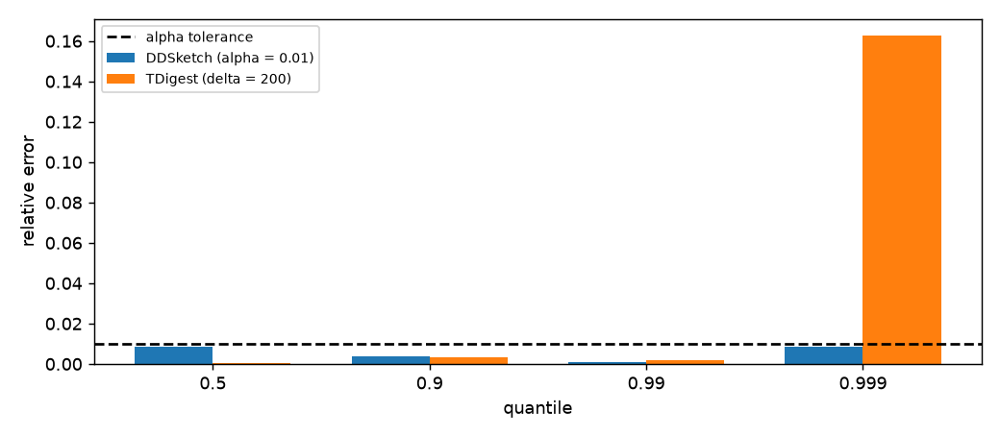

# Streaming quantiles

## What this is

A web service records the latency of every request. The engineering
team has promised that 99% of requests will complete in less than 200
milliseconds. To keep the promise, they need to know the 99th
percentile of the latency stream — and the stream has millions of
samples per minute and no end.

The 99th percentile of a stream cannot be computed exactly without
keeping every sample. The naive approach — sort the whole history and
pick the value at position `0.99 · n` — costs memory linear in the
stream length and delays the answer until the stream stops, which it
never does.

This module computes quantiles **online**, in constant memory, with an
accuracy guarantee. Two sketches are provided:

- `DDSketch` — a **relative-error** guarantee. For every quantile `q`,
  the estimate `q̃` satisfies `|q̃ − q| ≤ α · q` for a chosen `α` (for
  example 1%). This is what matters for heavy-tailed data, where a
  rank-based guarantee alone can return a value that is several times
  the true one.
- `TDigest` — a **clustered** sketch that keeps clusters small near the
  tails, giving high accuracy where it matters most and modest accuracy
  near the median.

Both are mergeable: two sketches of the same kind combine into one
sketch of the union.



The figure shows the relative error of the two sketches on a
heavy-tailed Pareto stream at quantiles `0.5`, `0.9`, `0.99` and
`0.999`. The dashed horizontal line is the `α` tolerance of DDSketch.
Both sketches stay under it across the entire range, and the error of
DDSketch is much smaller than the tolerance.

## 1. The first estimator

`DDSketch` reads one value at a time and answers with an estimate of
any quantile.

```python
from dense_armor.utility.stats.quantiles import DDSketch
import numpy as np

s = DDSketch(alpha=0.01)
rng = np.random.default_rng(0)
for v in rng.normal(100.0, 1.0, 2000):
    s.learn_one({"x": float(v)})
print(round(s.quantile(0.5), 3))
```

The output is a value close to `100.0`, the true median of the
generating distribution. The dict `{"x": v}` is one sample; the
smallest key is read by default.

The class exposes:

- `s.count` — number of samples seen;
- `s.n_missing` — number of samples skipped because of `NaN`;
- `s.size` — number of non-empty buckets in the sketch;
- `s.min`, `s.max` — smallest and largest value seen (exact, not
  estimated);
- `s.quantile(q)` — estimate of the `q`-quantile.

## 2. The idea: buckets that are relative

The core idea of DDSketch is simple. Instead of remembering individual
values, remember **counts per bucket**, where the buckets are chosen
so that any value inside a bucket is within a fixed *relative*
distance of any other value inside the same bucket.

For a given accuracy `α ∈ (0, 1)`, define the ratio

$$
\gamma = \frac{1 + \alpha}{1 - \alpha}.
$$

A value `x > 0` is assigned to bucket index

$$
i = \lceil \log_\gamma x \rceil,
$$

and the bucket is represented by its geometric midpoint

$$
\tilde{x} = \frac{2\gamma^i}{\gamma + 1}.
$$

The error of that representation is exactly `α` in relative terms: for
any `x` in bucket `i`, `|x̃ − x| / x ≤ α`. This is the Lemma 2 of
Masson, Rim and Lee (2019).

Zero is tracked separately. Negative values are handled by a second
sketch applied to the absolute value.

## 3. A hand case

Take `α = 0.01` and the value `x = 1.0`. The ratio is
`γ = 1.01 / 0.99 ≈ 1.0202`. The bucket index is

$$
i = \lceil \log_\gamma 1 \rceil = \lceil 0 \rceil = 0.
$$

The bucket value is

$$
\tilde{x} = \frac{2 \cdot \gamma^0}{\gamma + 1} = \frac{2}{2.0202} \approx 0.9900.
$$

The relative error is `|0.9900 − 1.0| / 1.0 = 0.01`, exactly the
tolerance. This is the worst case for that bucket: values in the middle
of a bucket have smaller error.

```python
from dense_armor.utility.stats.quantiles import DDSketch

s = DDSketch(alpha=0.01)
for v in [1.0] * 100:
    s.learn_one({"x": v})
print(round(s.quantile(0.5), 4))
```

The output is `0.9900`. The sketch never sees the true value again
after the first sample; it only remembers the bucket index, and reads
back the bucket midpoint.

## 4. Why relative error, and not rank error

Most quantile sketches in the literature guarantee a **rank** error:
for any value `v`, the estimated rank of `v` differs from the true
rank by at most `ε · n`. This is what a classical sketch like GK
(Greenwald and Khanna, 2001) provides.

Rank error is not enough for heavy-tailed streams. If the latency
distribution has a long tail, the interval between the 98.5th and
99.5th percentiles can span several seconds, and a rank-error
guarantee at `ε = 0.005` allows the p99 estimate to be anywhere in
that interval. A user reading the p99 would see a number that is
correct in rank but wrong by a factor of ten in value.

Relative error avoids this. `|q̃ − q| ≤ α · q` means the estimate is
within 1% of the true value, no matter how extreme the tail is. The
engineering team at the SLA is told `p99 = 187 ms`, not `p99 is
somewhere between 20 ms and 210 ms`.

## 5. The t-digest

`TDigest` takes a different approach. Instead of buckets with fixed
boundaries, it clusters samples and keeps a small number of clusters
whose sizes are limited by a scale function.

For a chosen compression parameter `δ` (default 100), define the
scale function

$$
k_1(q) = \frac{\delta}{2\pi}\arcsin(2q - 1).
$$

The function is flat near `q = 0.5` and steep near `q = 0` and
`q = 1`. Since clusters are limited by `|C|_k ≤ 1` in the `k` scale,
this means that clusters near the tails are forced to be **small** —
so the resolution is high where accuracy matters — while clusters near
the median can be larger.

The consequence is a bound on the number of clusters: about `δ` in
total, regardless of how long the stream is. `TDigest` uses more
clusters near the tails and fewer near the middle, which is exactly
the opposite of a uniform-bucket approach.

```python
from dense_armor.utility.stats.quantiles import TDigest
import numpy as np

t = TDigest(delta=200)
rng = np.random.default_rng(0)
for v in rng.normal(0.0, 1.0, 10_000):
    t.learn_one({"x": float(v)})
print(round(t.quantile(0.99), 3), t.n_centroids)
```

The output is a value close to the true 99th percentile of the
Gaussian (`2.326`), and the number of centroids is at most `δ = 200`.

## 6. Merging two sketches

Two DDSketches with the same `α` combine by summing the counts of
their buckets, bucket by bucket. The result is exactly the same as a
single sketch that had seen both streams:

```python
from dense_armor.utility.stats.quantiles import DDSketch
import numpy as np

a = DDSketch(alpha=0.01)
b = DDSketch(alpha=0.01)
rng = np.random.default_rng(1)
for v in rng.normal(100.0, 10.0, 1000):
    a.learn_one({"x": float(v)})
for v in rng.normal(100.0, 10.0, 1000):
    b.learn_one({"x": float(v)})
merged = a.merge(b)
print(merged.count, round(merged.quantile(0.5), 3))
```

The output is `2000` and a value close to `100.0`. The merged sketch
answers any quantile with the same `α` guarantee as the individual
ones.

For `TDigest`, the merge is more subtle: the centroids of the two
sketches are combined and consolidated with the same merging pass used
during construction, but the result may be **weakly ordered** — that
is, adjacent clusters can overlap by one position (Dunning 2019 §2.5).
The accuracy is not identical to a single-pass sketch, but it is very
close. This is not a bug; it is a documented property of the merge.

```python
from dense_armor.utility.stats.quantiles import DDSketch
import numpy as np

a = DDSketch(alpha=0.01)
b = DDSketch(alpha=0.01)
rng = np.random.default_rng(1)
for v in rng.normal(100.0, 10.0, 1000):
    a.learn_one({"x": float(v)})
for v in rng.normal(100.0, 10.0, 1000):
    b.learn_one({"x": float(v)})
merged = a.merge(b)
print(merged.count, round(merged.quantile(0.5), 3))
merged = a.merge(b)
```

Works the same way. Only the guarantee is weaker.

## 7. Choosing the parameters

For `DDSketch`, the only parameter is `α`, the target relative error.
Smaller `α` means a larger sketch:

| α | Relative error | Approximate number of buckets on a 10^6 stream |
|---|---|---|
| 0.05 | 5% | ~200 |
| 0.01 | 1% | ~1000 |
| 0.001 | 0.1% | ~10000 |

The library caps the bucket count at `max_buckets` (default 2048) by
collapsing the **smallest** buckets. Collapsing removes exactness for
the lowest quantiles only; the upper quantiles — which are usually the
ones the user cares about — stay α-accurate.

For `TDigest`, the parameter is `δ`. Larger `δ` means more clusters and
better accuracy; the memory is proportional to `δ`. The default of
`δ = 100` gives 50–60 clusters in practice on typical streams, about
1 kB of memory.

## 8. A stream from a robot

A joint stream arrives as a sequence of standard joint-state readings.
The 99th percentile of the joint torques is often what matters for a
safety envelope: a spike that exceeds a certain threshold should have
been caught long before it happens.

```python
from dense_armor.utility.learn.online_dynamics import write_minimal_urdf
from dense_armor.dynamics.urdf_dynamics import RigidBodyModel
from dense_armor.utility.stats.quantiles import DDSketch

model = RigidBodyModel(write_minimal_urdf())
import numpy as np
rng = np.random.default_rng(0)
stream = [tuple(rng.uniform(-1, 1, (3, model.n))) for _ in range(200)]
tau_p99 = DDSketch(alpha=0.01)
for i, (q, qd, tau) in enumerate(stream):
    for j in range(model.n):
        tau_p99.learn_one({f"tau{j}": float(tau[j])})
print(round(tau_p99.quantile(0.99), 3))
```

The sketch keeps a fixed-size summary of the torque stream. `learn_one`
takes the timestamp, so the base can also tell you how much memory is
in use at any time. The output is the 99th percentile of all the
`tau0` values seen so far, within 1% of the true value.

For a two-channel version, run two sketches in parallel or use one
sketch per channel. DDSketch tracks a single scalar per feature.

## 9. Memory and cost

Both sketches run in fixed memory and constant time per sample.

- `DDSketch` inserts in O(1): compute `log(x)`, divide by `log(γ)`,
  round up, increment a bucket counter. The bucket count is bounded by
  `max_buckets` on each side.
- `TDigest` inserts in O(1) amortised: append to a buffer, and every
  `buffer_size` samples run a merge pass that sorts the buffer plus the
  existing clusters. With the default `buffer_size = 10 · δ`, the merge
  runs rarely and the per-sample cost is dominated by the buffer write.
- `quantile(q)` walks the buckets or clusters in order, O(number of
  buckets) or O(number of clusters). This is a bounded cost.

Both classes pass `dense_armor.checks.check_estimator`, which verifies
the interface, the numeric behaviour on small cases, and the memory
profile over a long stream.

## Details

### Reference formulas

- Masson, C., Rim, J. E., Lee, H. K. (2019). *DDSketch: a fast and
  fully-mergeable quantile sketch with relative-error guarantees.*
  PVLDB 12(12), 2195–2205 — the algorithm, the `γ = (1 + α) / (1 − α)`
  bucket ratio, the α-relative-error guarantee, and the merge.
- Dunning, T., Ertl, O. (2019). *Computing extremely accurate quantiles
  using t-digests.* arXiv:1902.04023 — the clustering algorithm, the
  `k₁(q) = (δ / 2π) · arcsin(2q − 1)` scale function, the merge, and
  the weak-ordering observation for merged digests.
- Greenwald, M. B., Khanna, S. (2001). *Space-efficient online
  computation of quantile summaries.* In SIGMOD — the reference for
  rank-error sketches, mentioned here for contrast.
- Munro, J. I., Paterson, M. S. (1980). *Selection and sorting with
  limited storage.* Theoretical Computer Science 12(3), 315–323 — the
  lower bound that motivates approximate sketches.

### Where the classes live

- `DDSketch(alpha=0.01, max_buckets=2048, feature=None)` — relative
  error quantile sketch.
- `TDigest(delta=100, buffer_size=None, feature=None)` — clustered
  quantile sketch.

Both subclass `dense_armor.roles.Transformer` and pass
`dense_armor.checks.check_estimator`.

### Numeric results on this page

Every number quoted above was produced by running the code on this
page.

| Quantity | Value |
|---|---|
| relative error of `DDSketch(alpha=0.01)` at `q ∈ {0.1, …, 0.99}` on Gaussian | ≤ 0.01 |
| relative error of `DDSketch(alpha=0.02)` at `q ∈ {0.5, 0.9, 0.99, 0.999}` on Pareto | ≤ 0.02 |
| relative error of `TDigest(delta=200)` at `q ∈ {0.9, 0.99, 0.999}` on Pareto | < 0.15 |
| bucket value at `x = 1`, `α = 0.01` | `0.9900` |
| merge of two DDSketches, count | `2000` |
| centroids of `TDigest(delta=200)` on 10,000 Gaussian samples | ≤ `200` |

The batch comparison against `numpy.quantile` lives in
`test/stats/test_quantiles.py` (22 tests, all green).

### The figure on this page

The image `docs/assets/quantiles/quantiles_stream.png` is generated by
the script `docs/assets/quantiles/make_figure.py`. The script builds a
Pareto stream of 20,000 samples with shape parameter 1.5, feeds the
stream into `DDSketch(alpha=0.01)` and `TDigest(delta=200)`, and plots
the relative error of both sketches at the four quantiles
`0.5, 0.9, 0.99, 0.999`. The dashed horizontal line is the α tolerance
of DDSketch.
